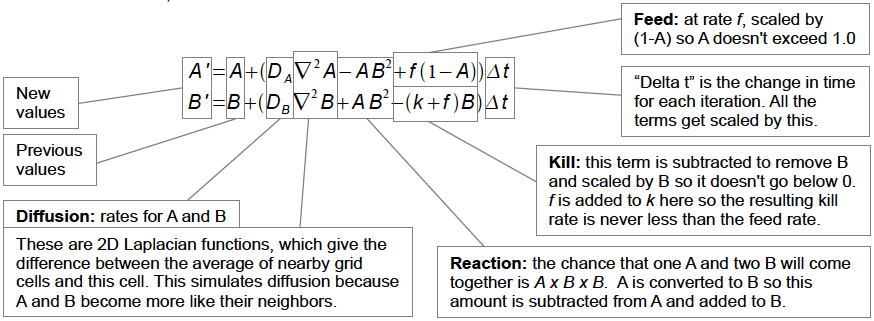

[Digital morphogenesis](https://en.wikipedia.org/wiki/Digital_morphogenesis) is the exploration of how shapes, forms, and patterns emerge in nature through the use of computational modeling and generative systems based on biological, chemical, and physical processes. It draws upon research from practically every area of the natural sciences and has applications in architecture, digital fabrication, art, engineering, biomedicine, and more.

With such a cross-disciplinary topic it can be hard to keep track of and correlate all the interesting bits of knowledge that one comes across, which is where this list comes in. The goal of this list is to succinctly catalog various growth algorithms and lab experiments along with relevant math, physics, and programming concepts in one place in order to (1) serve as a sort of "cheat sheet" reference for developers and computer artists, and (2) spark new insights by making it easier to see relationships between seemingly disparate topics.

[Contributions](https://github.com/jasonwebb/morphogenesis-resources/blob/main/CONTRIBUTING.md) are always welcome! If you'd like to add a description for any topic, or have some interesting and relevant links to share, or know of a topic that should be included somewhere in this document, please feel free to [open an issue](https://github.com/jasonwebb/morphogenesis-resources/issues/new) or a PR with your changes.

<br>

<table>
  <thead>
    <tr>
      <th>Table of contents</th>
    </tr>
  </thead>
  <tbody>
    <tr>
      <td>
        <details>
          <summary>Growth algorithms <a href="#growth-algorithms">[#]</a></summary>
          <p>
            <ul>
              <li><a href="#dielectric-breakdown-model-dbm">Dielectric breakdown model (DBM)</a></li>
              <li><a href="#diffusion-limited-aggregation-dla">Diffusion-limited aggregation (DLA)</a></li>
              <li><a href="#differential-growth">Differential growth</a></li>
              <li><a href="#eden-growth-model">Eden growth model</a></li>
              <li><a href="#physarum">Physarum</a></li>
              <li><a href="#primordial-particle-system">Primordial Particle System</a></li>
              <li><a href="#reaction-diffusion">Reaction-diffusion</a></li>
              <li><a href="#space-colonization">Space colonization</a></li>
            </ul>
          </p>
        </details>
        <details>
          <summary>Math and physics topics <a href="#math-and-physics-topics">[#]</a></summary>
          <p>
            <ul>
              <li><a href="#archimedean-solids">Archimedean solids</a></li>
              <li><a href="#cellular-automata-ca">Cellular automata</a></li>
              <li><a href="#cymatics">Cymatics</a></li>
              <li><a href="#delaunay-triangulation-and-voronoi-diagrams">Delaunay triangulation and Voronoi diagrams</a></li>
              <li><a href="#fibonacci-sequence">Fibonacci sequence</a></li>
              <li><a href="#fourier-series">Fourier series</a></li>
              <li><a href="#fractals">Fractals</a></li>
              <li><a href="#geodesic-dome">Geodesic dome</a></li>
              <li><a href="#golden-angle">Golden angle</a></li>
              <li><a href="#golden-ratio">Golden ratio</a></li>
              <li><a href="#implicit-surface">Implicit surface</a></li>
              <li><a href="#inverse-and-forward-kinematics">Inverse and forward kinematics</a></li>
              <li><a href="#laplace-transform">Laplace transform</a></li>
              <li><a href="#lissajous-curves">Lissajous curves</a></li>
              <li><a href="#medial-axis">Medial axis</a></li>
              <li><a href="#minimal-surface">Minimal surface</a></li>
              <li><a href="#packing-problems">Packing problems</a></li>
              <li><a href="#percolation-theory">Percolation theory</a></li>
              <li><a href="#phyllotaxis">Phyllotaxis</a></li>
              <li><a href="#platonic-solids">Platonic solids</a></li>
              <li><a href="#saffmantaylor-instability">Saffman–Taylor instability</a></li>
              <li><a href="#spherical-harmonics">Spherical harmonics</a></li>
              <li><a href="#strange-attractors">Strange attractors</a></li>
              <li><a href="#superellipse">Superellipse</a></li>
              <li><a href="#superformula">Superformula</a></li>
            </ul>
          </p>
        </details>
        <details>
          <summary>Natural phenomena</summary>
          <p>
            <i>See <a href="https://github.com/jasonwebb/morphogenesis-resources/blob/main/Natural-phenomena.md">Natural-phenomena.md</a></i>
          </p>
        </details>
        <details>
          <summary>Lab experiments <a href="#lab-experiments">[#]</a></summary>
          <p>
            <ul>
              <li><a href="#belousovzhabotinsky-bz-reaction">Belousov–Zhabotinsky (BZ) reaction</a></li>
              <li><a href="#chladni-plate">Chladni plate</a></li>
              <li><a href="#hele-shaw-cell">Hele-Shaw cell</a></li>
              <li><a href="#schlieren-imaging">Schlieren imaging</a></li>
            </ul>
          </p>
        </details>
        <details>
          <summary>Useful code patterns and techniques <a href="#useful-code-patterns-and-techniques">[#]</a></summary>
          <p>
            <ul>
              <li><a href="#agent-based-modelling">Agent-based modelling</a></li>
              <li><a href="#boids">Boids</a></li>
              <li><a href="#collision-detection">Collision detection</a></li>
              <li><a href="#constructive-solid-geometry-csg">Constructive solid geometry (CSG)</a></li>
              <li><a href="#dithering">Dithering</a></li>
              <li><a href="#flow-field">Flow field</a></li>
              <li><a href="#fluid-simulation">Fluid simulation</a></li>
              <li><a href="#lloyds-relaxation">Lloyd's relaxation</a></li>
              <li><a href="#marching-squares">Marching squares</a></li>
              <li><a href="#marching-cubes">Marching cubes</a></li>
              <li><a href="#metaballs">Metaballs</a></li>
              <li><a href="#noise">Noise</a></li>
              <li><a href="#particle-system">Particle system</a></li>
              <li><a href="#physics-engine">Physics engine</a></li>
              <li><a href="#polygon-clipping">Polygon clipping</a></li>
              <li><a href="#ray-tracing">Ray tracing</a></li>
              <li><a href="#recursion">Recursion</a></li>
              <li><a href="#shaders">Shaders</a></li>
              <li><a href="#signed-distance-function-sdfs">Signed distance functions (SDFs)</a></li>
              <li><a href="#spatial-index">Spatial index</a></li>
              <li><a href="#vectors">Vectors</a></li>
              <li><a href="#wave-function-collapse-wfc">Wave Function Collapse (WFC)</a></li>
            </ul>
          </p>
        </details>
        ▸ <a href="#books-publications-and-talks">Books, publications, and talks</a><br>
        ▸ <a href="#software">Software</a>
      </td>
    </tr>
  </tbody>
</table>

<br>

## Growth algorithms

### Dielectric breakdown model (DBM)

```
TODO
```

* Rigid and elastic bond models

_Articles:_
* [Dielectric breakdown model](https://en.wikipedia.org/wiki/Dielectric_breakdown_model) on Wikipedia
* [Fractal Dimension of Dielectric Breakdown](http://laplace.ucv.cl/Patterns/Referencias/Pietronero-prl52-1033.pdf) (PDF) by L. Niemeyer, L. Pietronero, and H. J. Wiesmann

---

<a href="https://www.jasonwebb.io/2019/05/diffusion-limited-aggregation-experiments-in-javascript/" target="_blank"></a>

### Diffusion-limited aggregation (DLA)
Process in which particles of matter stick together (_aggregate_) as they chaotically move (_diffuse_) through a medium that provides some sort of resistive (_limiting_) force. As these particles clump together over time they form characteristic fractal branching structures known as [Brownian trees](https://medium.com/r/?url=https%3A%2F%2Fen.wikipedia.org%2Fwiki%2FBrownian_tree).

Very interesting macro-structures begin to emerge at around the 1-10 million particle range in 3D, but in order to get there you'll need to be smart about your rendering pipeline and make use of optimized code in a performant language or environment (C/C++, CUDA, GLSL shaders, Houdini, etc).

_Algorithm at a glance:_
1. Add initial point(s) or shapes to seed growth.
2. Add a number of walker particles.
3. In each tick of the simulation, do the following:
   1. Move each walker a small amount in a random direction.
   2. If any walker particle is colliding with a fixed/clustered particle, convert that walker particle into a fixed/clustered particle.

_Key terms:_
* Walker - randomly-moving particle not attached to any other particle
* Cluster - group of multiple particles stuck together
* [Brownian tree](https://en.wikipedia.org/wiki/Brownian_tree) - name of characteristic branching structure that emerges

_Articles:_
* [Diffusion-limited aggregation](https://en.wikipedia.org/wiki/Diffusion-limited_aggregation) on Wikipedia
* [Diffusion-Limited Aggregation, a Kinetic Critical Phenomenon](http://ancient.hydro.nsc.ru/MPP_Specourse/witten81.pdf) (1981) by Thomas Witten and Leonard Sander. The article that started it all! _Note: visit your local library or a university library and ask a librarian if they can help you get free access!_
* [Diffusion-limited aggregation: A kinetic critical phenomenon?](http://www.thp.uni-koeln.de/krug/teaching-Dateien/SS2012/Sander2000.pdf) (2000) by Leonard Sander. Follow-up to the original article.
* [Simulating 2D diffusion-limited aggregation (DLA) with JavaScript](https://medium.com/@jason.webb/simulating-dla-in-js-f1914eb04b1d) by Jason Webb
* [DLA - Diffusion Limited Aggregation](http://paulbourke.net/fractals/dla/) by Paul Bourke
* [Diffusion-Limited Aggregation](https://softologyblog.wordpress.com/tag/diffusion-limited-aggregation/) by Softology
* [Pushing 3D Diffusion-Limited Aggregation even further](https://softologyblog.wordpress.com/2017/05/22/pushing-3d-diffusion-limited-aggregation-even-further/) by Softology

_Code projects:_
* [dlaf](https://github.com/fogleman/dlaf) (C++ w/ Boost) by Michael Fogleman <br><i>Introduces a novel, super-efficient method of collision detection, [described here](https://twitter.com/FogleBird/status/1093611865912025089).</i>
* [2D diffusion-limited aggregation (DLA) experiments in JavaScript](https://jasonwebb.github.io/2d-diffusion-limited-aggregation-experiments/) ([Github repo](https://github.com/jasonwebb/2d-diffusion-limited-aggregation-experiments)) by Jason Webb
* [simutils-0001: Diffusion limited aggregation](http://toxiclibs.org/2010/02/new-package-simutils/) by Karsten Schmidt (toxiclibs)
* [Simulate: Diffusion-Limited Aggregation](http://formandcode.com/code-examples/simulate-dla) from FORM+CODE book examples
* [Dendron](http://www.flong.com/projects/dendron/) Processing sketch by Golan Levin

_Creative projects:_
* [Aggregation](http://www.andylomas.com/aggregation.html) series by Andy Lomas

_Notable software:_
* [Visions of Chaos](https://www.softology.com.au/voc.htm)
* [glChAoS.P](https://github.com/BrutPitt/glChAoS.P) by Michele Morrone (BrutPitt)

_Videos:_
* [Coding Challenge #34: Diffusion-Limited Aggregation](https://www.youtube.com/watch?v=Cl_Gjj80gPE) by Daniel Shiffman ([Github repo](https://github.com/CodingTrain/website/tree/master/CodingChallenges/CC_034_DLA/P5))
* [Coding Challenge #127: Brownian Tree Snowflake](https://www.youtube.com/watch?v=XUA8UREROYE) by Daniel Shiffman ([Github repo](https://github.com/CodingTrain/website/tree/master/CodingChallenges/CC_127_Snowflake_Brownian))
* [VEX in Houdini: Diffusion Limited Aggregation (Plus Rendering In Mantra & Redshift)](https://vimeo.com/218372128) by Entagma


---

<a href="https://www.jasonwebb.io/2019/05/differential-growth-experiments-in-javascript/" target="_blank">
</a>

### Differential growth
Process that acts on continuous chains of nodes connected by lines using simple rules (attraction, repulsion, alignment; not unlike boids) in order to produce undulating, buckling forms that mimic or simulate meandering rivers, rippled surface textures of plants/seeds/fruits, space-filling behaviors of worms, snakes, intestines, and much more.

_Algorithm at a glance:_

2D:
1. Begin with a set of nodes connected in a chain-like fashion to form a path (or multiple paths). Each node should have a maximum of two neighbors (one preceding, one following).
2. In each tick of the simulation, for each node:
   1. Move node towards it's connected neighbor nodes (attraction).
   2. If node gets too close to _any_ nearby nodes (connected or not), move it away from them (repulsion).
   3. Move node towards the midpoint of an imaginary line between it's preceding and following nodes (alignment). It wants to rest equidistance between them with as little deflection as possible.
3. In each tick of the simulation, evaluate the distances between each pair of connected nodes. If too great, insert a new node between them (adaptive subdivision).
4. At some interval, insert new nodes in the chain to over-constrain the system and induce growth. The bends and undulations that emerge are a result of the system trying to equalize the forces using the rules defined in step 2.

_Articles and discussions:_
* [Exploring 2D differential growth with JavaScript](https://medium.com/@jason.webb/2d-differential-growth-in-js-1843fd51b0ce) by Jason Webb
* [Differential line](https://inconvergent.net/generative/differential-line/) by Anders Hoff (inconvergent)
* [Sheparding Random Growth](https://inconvergent.net/2016/shepherding-random-growth/) by Anders Hoff (inconvergent)
* [Differential Mesh Growth discussion thread](https://forums.odforce.net/topic/25534-differential-curve-growth/) on od|force forums
* [Organic Labrynths and Mazes](http://www.dgp.toronto.edu/~karan/artexhibit/mazes.pdf) (PDF) paper by Hans Pederson and Karen Singh

_Code projects:_
* [2D differential growth experiments](https://jasonwebb.github.io/2d-differential-growth-experiments/) by Jason Webb ([Github repo](https://github.com/jasonwebb/2d-differential-growth-experiments))
* [Differential line growth with Processing](http://www.codeplastic.com/2017/07/22/differential-line-growth-with-processing/) by Alberto Giachino
* [Real-time differential growth in JavaScript](http://adrianton3.github.io/blog/art/differential-growth/differential-growth.html) by [Adrian Toncean](https://github.com/adrianton3)
* [Differential Line Growth](http://www.entagma.com/differential-line-growth/) by Maritz Schwind of Entagma
* [Differential Growth](https://codepen.io/MAKIO135/pen/EwYPmb) by Lionel Radisson

_Creative projects:_
* [Floraform - an exploration of differential growth](https://n-e-r-v-o-u-s.com/blog/?p=6721) by Nervous System
* [Floraform Chandelier at World Expo 2017 in Astana, Kazakhstan](https://n-e-r-v-o-u-s.com/blog/?p=7702) by Nervous System

---

<a href="https://www.researchgate.net/figure/color-online-A-small-Eden-cluster-with-6000-particles-The-border-is-depicted-in-red_fig1_1858140" target="_blank">
</a>

### Eden growth model
Created by Murray Eden in 1961, this is a type of surface fractal growth process where material randomly accumulates on the _boundary_ of clusters. Sort of like DLA but without all the empty space between branches. Thought to be a good way to model certain kinds of bacterial and lichen growth.

_Articles:_
* [A Two Dimensional Growth Process](https://projecteuclid.org/download/pdf_1/euclid.bsmsp/1200512888) by Murray Eden (original 1961 paper)

---

<a href="https://cargocollective.com/sagejenson/physarum" target="_blank"></a>

### Physarum

_Image credit to [Sage Jenson](https://www.sagejenson.com/physarum) ([@mxsage](https://www.instagram.com/mxsage/))_

Technique for modelling the observed behaviors of the slime mold [physarum polycephalum](https://en.wikipedia.org/wiki/Physarum_polycephalum) using [agent-based modelling](#agent-based-modelling). Originally described in 2010 paper by Jeff Jones, and more recently popularized by artist Sage Jensen (@mxsage), this algorithm produces highly dynamic and organic-looking webs that can seem very life-like and biological in nature.

_Algorithm at a glance:_

_\* indicates a potential simulation parameter_

1. Consider the simulation space as a grid, with each cell storing a number representing the combined strength of pheromones left by the agents who have passed through it.
    * Pheromones in each cell diffuse at some rate\* to neighboring cells as they decay (at some rate\*) in each step of the simulation.
1. Add a set of points, each representing an autonomous [agent](#agent-based-modelling).
1. Each agent leaves a trail of decaying pheromones behind by adding a number\* to the cells it passes through.
1. Each agent senses the total phermone strength of cells in front of it defined by a distance\* and a field of view angle\*.
1. An agent will gradually adjust its direction\* to steer towards the cell(s) with the most pheromones.
1. Render the trails (not the agents) by mapping the pheromone strength number in each cell to a range or gradient of colors.

_Articles:_
* [Characteristics of Pattern Formation and Evolution in Approximations of Physarum Transport Networks](http://eprints.uwe.ac.uk/15260/1/artl.2010.16.2.pdf) (PDF) by Jeff Jones - original paper
* [Physarum Simulations](https://softologyblog.wordpress.com/2019/04/11/physarum-simulations/) by Softology
* [Physarum polycephalum](https://en.wikipedia.org/wiki/Physarum_polycephalum) on Wikipedia
* [Understanding the Physarum Simulation](https://denizbicer.com/202408-UnderstandingPhysarum.html) by Deniz Bicer ([breakdown thread](https://x.com/ojelibalon/status/1820839257793233164))

_Code projects:_
* [Simulating slime mold with WebGL](https://kaesve.nl/projects/mold/summary.html) by Ken Voskuil
* [physarum](https://github.com/nicoptere/physarum) (JavaScript with ThreeJS) by Nicolas Barradeau
* [Physarum](https://github.com/DenizBicer/Physarum) (Unity) by Deniz Bicer
* [Physarealm](https://github.com/maajor/Physarealm) (Rhino + Grasshopper) by Ma Yidong
* [Physarum](https://github.com/janivanecky/Physarum) (C++, with 2D and 3D implementations) by Jan Ivanecky

_Creative projects:_
* [physarum](https://sagejenson.com/physarum) by Sage Jenson (mxsage)
* [Slime mold](http://ch3.gr/2018/slime-mold/) by Georgios Cherouvim

---

### Primordial Particle System

```
TODO
```

_Articles:_
* [Primordial Particle Systems](http://zool33.uni-graz.at/artlife/PPS) from the Artificial Life Laboratory in Graz, Austria.
* [How a life-like system emerges from a simple particle motion law](https://www.nature.com/articles/srep37969) Thomas Schmickl, Martin Stefanec & Karl Crailsheim

---

</a>

### Reaction-diffusion

Grid-based process that generates complex and dynamic patterns based the interactions of two chemicals as they _diffuse_ through a medium and _react_ with one another. At every location on the grid these chemicals (usually referred to as `A` and `B`) have a chance of causing a _reaction_ that converts chemicals of one type to another based on their relative concentrations at that location.

Throughout the simulation chemical `A` is added at a particular _feed rate_ (`f`) and chemical `B` is removed at a particular _kill rate_ (`k`) - adjusting these rates can result in wildly different emergent patterns.

_Equation (via [Karl Sims](https://www.karlsims.com/rd.html)):_


_Key terms:_
* Feed rate - rate at which chemical `A` is added to system
* Kill rate - rate at which chemical `B` is removed from the system
* Diffusion rate - rate at which each chemical spreads, which acts as a kind of scaler to a 3x3 [Laplacian transform](#laplace-transform)
* Reaction chance - probability that one `A` will be converted to a `B` when in the presence of two `B`s.
* Gray-Scott model
* [Pearson's classification](http://mrob.com/pub/comp/xmorphia/pearson-classes.html)
* [Turing patterns](https://en.wikipedia.org/wiki/Turing_pattern)

_Articles:_
* [Reaction-diffusion system](https://en.wikipedia.org/wiki/Reaction%E2%80%93diffusion_system) on Wikipedia
* [Reaction-Diffusion Tutorial](https://www.karlsims.com/rd.html) by Karl Sims
* [Reaction-Diffusion by the Gray-Scott Model: Pearson's Parametrization](https://mrob.com/pub/comp/xmorphia/) by Robert Munafo (mrob)
* [Reaction Diffusion: The Gray-Scott Algorithm](https://www.algosome.com/articles/reaction-diffusion-gray-scott.html) by Algosome
* [The Chemical Basis of Morphogenesis](http://www.dna.caltech.edu/courses/cs191/paperscs191/turing.pdf) (PDF) paper by Alan Turing (1952)

_Notable tools:_
* [Ready](https://github.com/GollyGang/ready)

_Code projects:_
* [Gray–Scott Reaction Diffusion](https://observablehq.com/@mbostock/gray-scott-reaction-diffusion) (JavaScript + WebGL) by Mike Bostock
* [Gray-Scott - JavaScript experiments](https://github.com/pmneila/jsexp) by @pmneila
* [simutils-0001: Gray-Scott reaction diffusion](http://toxiclibs.org/2010/02/simutils-grayscott/) by toxiclibs
* [ofxReactionDiffusion](https://github.com/matsune/ofxReactionDiffusion) add-on for openFrameworks by Yuma Matsune
* [ofxRD](https://github.com/aanrii/ofxRD) add-on for openFrameworks by aanri
* [Reaction Diffusion](https://www.redblobgames.com/x/1905-reaction-diffusion/) (JavaScript + WebGL) by Red Blob Games
* [Reaction Diffusion](https://kaesve.nl/projects/reaction-diffusion/readme.html) by Ken Voskuil (look in the DOM)
* [Reaction-Diffusion Playground](https://github.com/jasonwebb/reaction-diffusion-playground) (JavaScript, ThreeJS/WebGL, shaders) by Jason Webb
* [Reaction-Diffusion Simulation in Three.js](https://github.com/colejd/Reaction-Diffusion-ThreeJS) (JavaScript + ThreeJS) by Jonathan Cole
* [Reaction diffusion with C++ and SFML](https://github.com/Deedone/Small-projects/tree/master/Reaction-diffusion) by Deedone
* [Reaction-Diffusion simulation with C++, SFML, & Cuda](https://github.com/Solidsilver/PDEProj/tree/master/Numerics) by Luka Mattfield (@Solidsilver)
* [ReaDDy](https://readdy.github.io/) (C++ with Python bindings)
* [RDSystem](https://github.com/keijiro/RDSystem) (Unity) by Keijiro Takahashi
* [Multiscale Turing Patterns](https://github.com/rreusser/rreusser.github.io/tree/master/src/src/multiscale-turing-patterns) (JavaScript, GLSL, regl) by Ricky Reusser
  * Read his [write-up](http://rreusser.github.io/multiscale-turing-pattern-gallery/) and try the [live version here](https://rreusser.github.io/multiscale-turing-patterns).
  * [Available on Observable too](https://observablehq.com/@rreusser/multiscale-turing-patterns-in-webgl).

_Creative projects:_
* [Jonathan McCabe](http://www.jonathanmccabe.com/)'s multi-scale Turing pattern series. See [Diatomaceous](https://www.flickr.com/photos/jonathanmccabe/albums/72157623472782429), [Bone Music](https://www.flickr.com/photos/jonathanmccabe/albums/72157614896989696) [[2]](https://www.flickr.com/photos/jonathanmccabe/albums/72157624469963762) [[3]](https://www.flickr.com/photos/jonathanmccabe/albums/72157625117546281), [Multi-Scale Turing Patterns](https://www.flickr.com/photos/jonathanmccabe/albums/72157644907151060) and [others](https://www.flickr.com/photos/jonathanmccabe/albums)
  * See his paper [Cyclic Symmetric Multi-Scale Turing Patterns](http://www.jonathanmccabe.com/Cyclic_Symmetric_Multi-Scale_Turing_Patterns.pdf) (PDF), and [this post from Softology](https://softologyblog.wordpress.com/2011/07/05/multi-scale-turing-patterns/) explaining it.
* [3D Printed Reaction Diffusion Patterns](https://www.instructables.com/id/3D-Printed-Reaction-Diffusion-Patterns/) Instructable by Reza Ali
* [Processing: Reaction Diffusion Halftone patterns](https://vimeo.com/233530691) by Ignazio Lucenti
* [Coral Cup](https://n-e-r-v-o-u-s.com/blog/?p=8222) by Nervous System
* [Reaction Lamps](https://n-e-r-v-o-u-s.com/projects/albums/reaction-products/) by Nervous System
* [Reaction Table](https://n-e-r-v-o-u-s.com/projects/albums/reaction-table/) and [reaction shelf](https://n-e-r-v-o-u-s.com/blog/?p=992) by Nervous System
* [Reaction-Diffusion Media Wall](http://www.karlsims.com/rd-exhibit.html) by Karl Sims
* [DIFFUSION](http://kouheinakama.com/diffusion/) by Kouhei Nakama
* [Reaction Diffusion](https://vimeo.com/267338427) using point clouds by David Grzesik. See his [write-up here](http://davidgrzesik.com/breakdown_docs/S17_V350_P1_GrzesikDavid_ReactionDiffusion.pdf) (PDF)
* [Grey Scott’s Reaction Diffusion - Houdini VEX](https://vimeo.com/104572358) by Ali Seiffouri
* [Healing series](http://www.blep.com/works/healing-series/) by Brian Knep
* [Silhouect](https://cacheflowe.com/code/installation/silhouect) by Justin Gitlin (@cacheflowe)
* [Reaction diffusion](https://vimeo.com/401715181) by Artur Żarejko

_Videos:_
* [Fun with Reaction-Diffusion in Houdini](https://www.youtube.com/watch?v=K_7TkoIkFhk) by Dan Willis at SIGGRAPH Asia 2019.
* Reaction Diffusion video series for Houdini by Entagma:
  * [Part I: Theory](https://vimeo.com/170073061)
  * [Part II: Implementation](https://vimeo.com/170073069)
  * [Part III: Shaping Growth](https://vimeo.com/170073079)
* [Coding Challenge #13: Reaction Diffusion Algorithm in p5.js](https://www.youtube.com/watch?v=BV9ny785UNc) by Daniel Shiffman ([Github repo](https://github.com/CodingTrain/website/tree/master/CodingChallenges/CC_013_ReactionDiffusion) with both p5.js and Processing source code)
* [Reaction Diffusion: A Visual Explanation](https://www.youtube.com/watch?v=LMzYrsfTiEw) by Arsiliath

---

<a href="https://www.jasonwebb.io/2020/03/space-colonization-branching-experiments-in-javascript/" target="_blank">
</a>

### Space colonization

Process for iteratively growing networks of branching lines based on the distribution of growth hormone sources (called "auxin" sources) to which the lines are attracted. Originally described by Adam Runions and collaborators at the [Algorithmic Botany group](http://algorithmicbotany.org/) at the University of Calgary, this system can be used to simulate the growth of leaf venation patterns and tree-like structures, as well as many other vein-like systems like Gorgonian sea fans, circulatory systems, root systems, and more.

The original algorithm describes methods for generating both "open" (as seen in the example GIF) and "closed" venation networks, referring to whether or not secondary or tertiary veins connect together to form loops (or _anastomoses_).

_Algorithm at a glance:_

For both the open and closed variants of this algorithm, begin by placing a set of points on the canvas representing sources of either the auxin growth hormone (as in leaves) or ambient nutrients (as in trees).

Open venation:

1. Associate each auxin source with the single closest vein segment within a pre-defined _attraction distance_.
2. For each vein segment that is associated with at least one auxin source, calculate the average direction towards them as a normalized vector and generate a new vein segment that extends in that direction at a pre-defined segment length (by scaling the normalized direction vector by that length).
3. Remove any auxin sources that have vein segments within a pre-defined _kill distance_ around it.

Closed venation:

1. Associate each auxin source with all of the vein segments that are both within a pre-defined _attraction distance_ and within the source's  _relative neighborhood_.
2. For each vein segment that is associated with at least one auxin source, calculate the average direction towards them as a normalized vector and generate a new vein segment that extends in that direction at a pre-defined segment length (by scaling the normalized direction vector by that length).
3. Remove any auxin sources that have been reached by _all_ of their associated vein segments.

Auxin flux canalization:

1. Give each vein segment a uniform default thickness to start with.
2. Beginning at each terminal vein segment (that is, segments with no child segments), traverse "upwards" through each parent vein segment, adding their child vein segment thickness to their own until you reach a root vein segment (a segment with no parent segment).

_Key terms:_

* Auxin source = a discrete location towards which vein segments are attracted. In biology, auxin is a hormone found in plants that promotes growth.
* Auxin flux canalization = process by which veins become thicker as they grow longer. The longer a vein gets, the more auxin flows through it ("flux"), causing veins to progressively thicken from their tips to their roots. "Canalization" references the process by which "canals" of water form.
* [Relative neighborhood](https://en.wikipedia.org/wiki/Relative_neighborhood_graph) = point _P_ is a relative neighbor of a point _Q_ if there is no other point _R_ closer to _P_ and _Q_ than they are to each other.

_Articles and papers:_
* [Modeling and visualization of leaf venation patterns](http://algorithmicbotany.org/papers/venation.sig2005.pdf) (PDF) original 2005 paper by Adam Runions, Martin Fuhrer, Brendan Lane, Pavol Federl, Anne−Gaëlle Rolland−Lagan, and Przemyslaw Prusinkiewicz
* [Modeling Trees with a Space Colonization Algorithm](http://algorithmicbotany.org/papers/colonization.egwnp2007.large.pdf) (PDF) 2007 paper by Adam Runions, Brendan Lane, and Przemyslaw Prusinkiewicz
* [Modeling organic branching structures with the space colonization algorithm and JavaScript](https://medium.com/@jason.webb/space-colonization-algorithm-in-javascript-6f683b743dc5) by Jason Webb
* [Procedurally Generated Trees with Space Colonization Algorithm in XNA C#](http://www.jgallant.com/procedurally-generating-trees-with-space-colonization-algorithm-in-xna/) by Jon Gallant
* [Part 26: Trees](http://www.sea-of-memes.com/LetsCode26/LetsCode26.html) by Michael Goodfellow
* [Art-directing procedural vegetation in Houdini using a space colonization algorithm](https://pdfs.semanticscholar.org/b907/013067a5f669de7598845d7a8b45a41815f0.pdf?_ga=2.245171206.200415744.1583546111-797165566.1583546111) (PDF) by Marta Feriani

_Creative projects:_
* [Hyphae](https://n-e-r-v-o-u-s.com/shop/line.php?code=8) and [Xylem](https://n-e-r-v-o-u-s.com/shop/line.php?code=6) series by Nervous System
  * Also see their [Xylem Experiments and Improvements](https://n-e-r-v-o-u-s.com/blog/?p=1218) write-up
* [Bromeliad](https://n-e-r-v-o-u-s.com/shop/product.php?code=286) and [Calyx](https://n-e-r-v-o-u-s.com/shop/product.php?code=285&search=download) lamps by Nervous System

_Code projects:_
* [ofxSpaceColoinzation](https://github.com/edap/ofxSpaceColonization) add-on for openFrameworks
* [space-colonization](https://github.com/nicknikolov/space-colonization) (JavaScript) by Nick Nikolov
* [Dendrite](https://github.com/mattatz/Dendrite) (Unity) by mattatz
* [Grower](https://github.com/joesfer/Grower) (Maya plugin) by Jose Esteve
* [Venation](https://github.com/nielmclaren/Venation) (Processing) by Niel McLaren
* [hyphae](https://github.com/jblondin/hyphae) (Julia) by Jamie Blondin
* [hyphae](https://github.com/inconvergent/hyphae) and [hyphae_ani](https://github.com/inconvergent/hyphae_ani) by Anders Hoff (inconvergent)
* [2d-space-colonizations-experiments](https://github.com/jasonwebb/2d-space-colonization-experiments) (JavaScript) by Jason Webb

_Videos:_
* [Coding Challenge #17: Fractal Trees - Space Colonization](https://www.youtube.com/watch?v=kKT0v3qhIQY) by Daniel Shiffman ([Github repo](https://github.com/CodingTrain/website/tree/master/CodingChallenges/CC_017_SpaceColonizer) with source code for p5.js and Processing)

<br>

## Math and physics topics

<a href="https://kids.britannica.com/students/assembly/view/230371" target="_blank">
</a>

### Archimedean solids

Set of 13 semi-regular convex polyhedra composed of regular polygons meeting in identical vertices, excluding the 5 [Platonic solids](#platonic-solids) (which are composed of only one type of polygon) and excluding the prisms and antiprisms.

Each shape [can be constructed](https://en.wikipedia.org/wiki/Archimedean_solid#Construction_of_Archimedean_solids) by starting with one of the [Platonic solids](#platonic-solids) and truncating it's corners or edges in various ways.

_List of Archimedean solids:_

| Name                        | Faces                                      | Edges | Vertices | Image |
|---                          |---                                         |---    |---       |---    |
| Truncated tetrahedron       | 4 triangles<br>4 hexagons                  | 18    | 12       |  |
| Cuboctahedron               | 8 triangles<br>6 squares                   | 24    | 12       |  |
| Truncated cube              | 8 triangles<br>6 octagons                  | 36    | 24       |  |
| Truncated octahedron        | 6 squares<br>8 hexagons                    | 36    | 24       |  |
| Rhombicuboctahedron         | 8 triangles<br>18 squares                  | 48    | 24       |  |
| Truncated cuboctahedron     | 12 squres<br>8 hexagons<br>6 octagons      | 72    | 48       |  |
| Snub cube                   | 32 triangles<br>6 squares                  | 60    | 24       |  |
| Icosidodecahedron           | 20 triangles<br>12 pentagons               | 60    | 30       |  |
| Truncated dodecahedron      | 20 triangles<br>12 decagons                | 90    | 60       |  |
| Truncated icosahedron       | 12 pentagons<br>20 hexagons                | 90    | 60       |  |
| Rhombicosidodecahedron      | 20 triangles<br>30 squares<br>12 pentagons | 120   | 60       |  |
| Truncated icosidodecahedron | 30 squares<br>20 hexagons<br>12 decagons   | 180   | 120      |  |
| Snub dodecahedron           | 80 triangles<br>12 pentagons               | 150   | 60       |  |

_Articles:_
* [Archimedean solid](https://en.wikipedia.org/wiki/Archimedean_solid) on Wikipedia
* [Archimedean Solid](http://mathworld.wolfram.com/ArchimedeanSolid.html) on Wolfram MathWorld
* [Archimedean Polyhedra](https://www.georgehart.com/virtual-polyhedra/archimedean-info.html) by George Hart

_Videos:_
* [Platonic and Archimedean solids](https://www.youtube.com/watch?v=U3cTXqvW3XU) by Henry Segerman

---

<a href="https://softologyblog.wordpress.com/2018/06/29/multiple-rules-cellular-automata/" target="_blank">
</a>

### Cellular automata (CA)
A regular grid of _cells_ with _states_ that are updated each iteration in according to _rules_. Developed by Stanislaw Ulam and John von Neumann at the Los Alamos National Laboratory in the 1940s, this system has been used to model physical, biological, and social phenomena with remarkable variety and accuracy.

_Key terms:_
* Cell - a discrete location on the grid
* State - the "value" of a cell. Many CAs just have two states (on/off), but others use many.
* Neighborhood - set of cells surrounding a given cell. Most common types are [Von Neumann](https://en.wikipedia.org/wiki/Von_Neumann_neighborhood) and [Moore](https://en.wikipedia.org/wiki/Moore_neighborhood), though others exist.
* Rule(s) - mathematical functions or if/else statement(s) that define what the next state of a cell should be based on various criteria like the states of that cell's neighbors. Sometimes called _transition rules_.
* Generation - result of one iteration of the system.

_Types:_
* [Asynchronous](https://en.wikipedia.org/wiki/Asynchronous_cellular_automaton) - automaton in which each cell is updated independantly of the others over time. Multiple [update schemes](https://en.wikipedia.org/wiki/Asynchronous_cellular_automaton#Update_Schemes) have been proposed by various researchers.
* [Block](https://en.wikipedia.org/wiki/Block_cellular_automaton) - automaton in which the grid of cells is divided into non-overlapping blocks, with rules being applied to entire blocks rather than individual cells. Also known as a partitioning cellular automaton.
* [Continuous](https://en.wikipedia.org/wiki/Continuous_automaton) - automaton in which each cell has a real number value instead of an integer state.
* [Continuous spatial](https://en.wikipedia.org/wiki/Continuous_spatial_automaton) - automaton in which the cell _locations_ are continuous.
* [Cyclic](https://en.wikipedia.org/wiki/Cyclic_cellular_automaton) - automaton in which cells are initialized with one of a number of states in a range, then can be "consumed" when a neighboring cell has a successor state, causing the cell's state to take on that successor state. In other words, if cells can take on a value in the range `[0,9]`, then a cell with value `2` can be "consumed" by a neighboring cell with value `3`, causing the cell to take on the value of `3`. When cells reach the state at the end of the range, they are reset to the state at the beginning of the range (wrapping around).
* Discrete - the "default" configuration for cellular automata, in which a grid of regular square cells and integer states are used.
* [Elementary](https://en.wikipedia.org/wiki/Elementary_cellular_automaton) - 1D cellular automata with two states and 256 possible rules. Thought to be the simplest possible cellular automaton.
* [Life-like](https://en.wikipedia.org/wiki/Life-like_cellular_automaton) - any 2D outer totalistic automaton that uses two states and a Moore neighborhood, and whose transition rule can be expressed as a function of the number of neighboring cells that are in the "alive" state. [Three standard rule notations](https://en.wikipedia.org/wiki/Life-like_cellular_automaton#Notation_for_rules) exist, and a large number of [rules have been identified and researched](https://en.wikipedia.org/wiki/Life-like_cellular_automaton#A_selection_of_Life-like_rules).
* [Reversible](https://en.wikipedia.org/wiki/Reversible_cellular_automaton) - automaton in which past grid states can be determined using later grid states. In other words, if you know the state at time `t`, you can compute the state at `t - 1`.
* [Second-order](https://en.wikipedia.org/wiki/Second-order_cellular_automaton) - automaton in which cell states depend on their neighborhood in the last _two_ generations. In other words, the state at time `t` depends on the state at both `t - 1` and `t - 2`.
* [Stochastic](https://en.wikipedia.org/wiki/Stochastic_cellular_automaton) - automaton with a transition rule that incorporates a probability distribution or, in other words, some degree of randomness. Also known as probabilistic (PCA) or random cellular automata.
* [Totalistic](https://en.wikipedia.org/wiki/Cellular_automaton#Totalistic) - automaton in which the state of each cell is based on the sum of the values of its neighbor cells in the previous iteration. If it also depends on its own state in the previous iteration then the automaton can be called _outer totalistic_ or _semitotalistic_.

_Wolfram's classification:_

Stephan Wolfram defined four classes that can be used to describe any cellular automaton or other simple computational model based on their observed behaviors. These definitions are qualitative in nature, with some room for intepretation, but are nonetheless considered the most effective classification scheme that currently exists for cellular automata.

* Class 1: Uniformity  -  nearly all initial patterns evolve quickly into a stable, homogeneous state. Any randomness in the initial pattern disappears.
* Class 2: Repetition  -  nearly all initial patterns evolve quickly into stable or oscillating structures. Some of the randomness in the initial pattern may filter out, but some remains. Local changes to the initial pattern tend to remain local.
* Class 3: Random  -  nearly all initial patterns evolve in a pseudo-random or chaotic manner. Any stable structures that appear are quickly destroyed by the surrounding noise. Local changes to the initial pattern tend to spread indefinitely.
* Class 4: Complexity  -  nearly all initial patterns evolve into structures that interact in complex and interesting ways, with the formation of local structures that are able to survive for long periods of time.

_Well-known rules and rule families:_
* [Brian's Brain](https://en.wikipedia.org/wiki/Brian%27s_Brain) by Brian Silverman
* [Game of Life](https://en.wikipedia.org/wiki/Conway%27s_Game_of_Life) by John Conway
* [Generations](https://conwaylife.com/wiki/Generations)
* [Lenia](https://arxiv.org/abs/1812.05433) ([repo](https://github.com/Chakazul/Lenia)) by Bert Wang-Chak Chan
* [Langton's Ant](https://en.wikipedia.org/wiki/Langton%27s_ant) by Chris Langton
* [Larger than Life](https://www.conwaylife.com/wiki/Larger_than_Life) by Kellie Michele Evans
* [SmoothLife](https://arxiv.org/pdf/1111.1567.pdf) by Stephan Rafler (original paper, PDF)
* [Wireworld](http://mathworld.wolfram.com/WireWorld.html) by Brian Silverman

_Articles, books, and other writings:_
* [Building simulations with a Go cellular automata framework](https://medium.com/swlh/building-simulations-with-a-go-cellular-automata-framework-89b2bb1246d3) by Sau Sheong
* [Cellular automaton](https://en.wikipedia.org/wiki/Cellular_automaton) on Wikipedia
* [Cellular Automata rules lexicon](http://www.mirekw.com/ca/ca_rules.html) in the MCell documentation by Mirek Wojtowicz
* [Chapter 7. Cellular Automata](https://natureofcode.com/book/chapter-7-cellular-automata/) from Daniel Shiffman's Nature of Code book
* [Elementary Cellular Automaton](http://mathworld.wolfram.com/ElementaryCellularAutomaton.html) on Wolfram MathWorld
* [New Kind of Science](https://www.wolframscience.com/nks/) by Stephan Wolfram
* [Understanding Multiple Neighborhood Cellular Automata](https://slackermanz.com/understanding-multiple-neighborhood-cellular-automata) by Slackermanz

_Code projects:_
* [cellauto.js](http://sanojian.github.io/cellauto/) ([source](https://github.com/sanojian/cellauto)) by Jonas Olmstead (JavaScript)
* [cellularAutomata](https://github.com/bollu/cellularAutomata) by Siddharth Bhat (Haskell)
* [Cellular Automata Simulator (CAS)](https://github.com/ghjansen/cas) by Guilherme Humberto Jansen (Java)
* [cellpylib](https://github.com/lantunes/cellpylib) by Luis Antunes (Python)
* [Lifelike](https://lifelike.psychedelicio.us/) ([source](https://github.com/psychedelicious/lifelike)) by @psychedelicious
* [regl-smooth-life](https://github.com/rreusser/demos/tree/master/smooth-life) by Ricky Reusser (JavaScript, WebGL, GLSL)
* [sandspiel](https://sandspiel.club/) ([source](https://github.com/MaxBittker/sandspiel)) by Max Bittker (JavaScript)
* [SmoothLife](https://github.com/duckythescientist/SmoothLife) by Sean Murphy (Python)
* [SmoothLife](https://sourceforge.net/projects/smoothlife/) by ionreq (C++, Matlab, BASIC)
* [terra.js](https://rileyjshaw.com/terra/) ([source](https://github.com/rileyjshaw/terra)) by Riley Shaw (JavaScript)
* Various packages and projects by Kevin Chapelier:
  * [cellular-automata](https://github.com/kchapelier/cellular-automata)
  * [cellular-automata-gpu](https://github.com/kchapelier/cellular-automata-gpu)
  * [cellular-automata-rule-parser](https://github.com/kchapelier/cellular-automata-rule-parser)
  * [cellular-automata-voxel-shader](https://github.com/kchapelier/cellular-automata-voxel-shader)

_Creative projects:_
* [3D printed Game of Life shoes](https://www.dezeen.com/2014/09/26/francis-bitonti-3d-printed-molecule-shoes-adobe-stratasys/) by Francis Bitonti
* [KnitYak: Custom mathematical knit scarves](https://www.kickstarter.com/projects/fbz/knityak-custom-mathematical-knit-scarves) by Fabienne "fbz" Serriere

_Notable software:_
* [cubes.io: 3d cellular automata](http://cubes.io/) by Charlie Deck
* [Golly](http://golly.sourceforge.net/)
* [MCell](http://psoup.math.wisc.edu/mcell/) (Mirek's Cellebration) by Mirek Wojtowicz
* [Visions of Chaos](https://www.softology.com.au/voc.htm) by Jason Rampe
* [WebCA / Cellular Automata Laboratory (CelLab)](https://www.fourmilab.ch/cellab/webca/) by Rudy Rucker and John Walker

---

<a href="https://en.wikipedia.org/wiki/Cymatics" target="_blank">
</a>

### Cymatics
_See [Chladni plate](#chladni-plate)_

Study of the visible effects of sound and vibration on physical media. Typically involves the vibration of a plate or membrane onto which fine powder or fluids have been placed, which subsequently arrange themselves into highly symmetrical, complex patterns based on the intensity of displacement of various regions of the vibrating plate. Areas that are moving a lot will "kick" material away from them while areas that are moving very little allow material to settle and accumulate. These areas of relatively little vibration are caused by destructive interference of waves as they propagate across the plate/membrane and become out of phase with one another, creating "dead zones" where these waves cancel each other out.

_Articles:_
* [Cymatics](https://en.wikipedia.org/wiki/Cymatics) on Wikipedia
* [Modal vibrational phenomena](https://en.wikipedia.org/wiki/Normal_mode) on Wikipedia

_Creative projects:_
* [CYMATICS: Science Vs. Music](https://vimeo.com/111593305) by Nigel Stanford
* [Cymatics](https://vimeo.com/74130357) by Susi Sie
* [The Essence of Sound](https://vimeo.com/89491724) by Susi Sie

---

<a href="https://en.wikipedia.org/wiki/Delaunay_triangulation" target="_blank">
</a>

### Delaunay triangulation and Voronoi diagrams
_Delaunay triangulation_ is a way of connecting a set of points to form a network of non-overlapping triangles. One of the key properties of Delaunay triangulations is that the [circumcircles](https://en.wikipedia.org/wiki/Circumscribed_circle) associated with each triangle contains no other points than their three triangle vertices. When extended into 3D, Delaunay triangulation is useful for creating meshes.

_Voronoi diagrams_ are the [dual](https://observablehq.com/@mbostock/the-delaunays-dual) of Delaunay triangulations. This means that once a Delaunay triangulation has been computed for a set of points, a Voronoi diagram can be drawn without any additional data - just draw lines connecting the centers of the circumcircles!

Voronoi diagrams are very useful for efficiently and organically partitioning (splitting up) both 2D and 3D space. They are especially good for accurately modelling the way soft bodies (like biological cells) get smushed together in constrained environments, like embryonic cells undergoing mitosis.

Voronoi diagrams are often used (perhaps overused) in digital fabrication applications, [especially 3D printing](https://www.google.com/search?q=voronoi+3d+printing&source=lnms&tbm=isch&sa=X&ved=0ahUKEwiQh-npy_HhAhUFSq0KHfBpClQQ_AUIDigB&biw=1920&bih=937), for their characteristic aesthetic style and their ability to reduce material usage while preserving overall form. Given their popularity among amateur 3D printing enthusiasts, this effect is probably best used sparingly in serious applications.

_Articles:_
* [Delaunay triangulation](https://en.wikipedia.org/wiki/Delaunay_triangulation) on Wikipedia
* [Voronoi diagram](https://en.wikipedia.org/wiki/Voronoi_diagram) on Wikipedia

---

<a href="https://en.wikipedia.org/wiki/Fibonacci_sequence" target="_blank">
</a>

### Fibonacci sequence
_Related to [Golden ratio](#golden-ratio)_

Sequence of numbers in which each number is the sum of it's two preceding numbers. [Binet's formula](https://en.wikipedia.org/wiki/Fibonacci_number#Binet's_formula) shows that the ratio of two consecutive numbers tends towards the [golden ratio](#golden-ratio) as the sequence progresses. Fibonacci numbers appear unexpectedly often in biology, having been observed in branching of trees, the arrangement of leaves on a stem, the fruit sprouts of a pineapple, the flowering of an artichoke, an uncurling fern and the arrangement of a pine cone's bracts.


<table>
 <thead>
  <tr>
   <th><center>Formula</center></th>
  </tr>
 </thead>
 <tbody>
  <tr>
   <td>
    <br>
    
   </td>
  </tr>
 </tbody>
</table>

Sequence begins with:


_Articles:_
* [Fibonacci sequence](https://en.wikipedia.org/wiki/Fibonacci_number) on Wikipedia
* [Fibonacci Sequence](https://www.mathsisfun.com/numbers/fibonacci-sequence.html) on Math Is Fun
* [Fibonacci Number](http://mathworld.wolfram.com/FibonacciNumber.html) on Wolfram MathWorld

---


### Fourier series
Series of sinusoidal wave functions that get added together to generate a different, more complex function. In the context of morphogenesis (form generation), any line drawing can be "deconstructed" into a series of arc segments which can in turn be represented by a series of circles whose radii and rotation speeds correspond to the radii and lengths of the arc segments.

Fourier series and Fourier transforms are deeply mathematical topics with applications and research far beyond the scope of this resource list. They are extremely useful in the field of digital signal processing for noise reduction, compression, audio analysis, and so much more. A very well-known algorithm known as the [fast Fourier transform (FFT)](https://en.wikipedia.org/wiki/Fast_Fourier_transform) enables extraction of waveforms from music for the purposes of audio visualization.

_Articles:_
* [Fourier series](https://en.wikipedia.org/wiki/Fourier_series) on Wikipedia
* [Fourier Series](http://mathworld.wolfram.com/FourierSeries.html) on Wolfram MathWorld
* [Fourier Series](https://www.mathsisfun.com/calculus/fourier-series.html) on Math Is Fun

_Videos:_
* [What is a Fourier Series? (Explained by drawing circles)](https://www.youtube.com/watch?v=ds0cmAV-Yek&vl=en) by Smarter Every Day
* [But what is the Fourier Transform? A visual introduction](https://www.youtube.com/watch?v=spUNpyF58BY) by 3Blue1Brown
* [Coding Challenge #125: Fourier Series](https://www.youtube.com/watch?v=Mm2eYfj0SgA) by Daniel Shiffman
* [Coding Challenge #130.1: Drawing with Fourier Transform and Epicycles](https://www.youtube.com/watch?v=MY4luNgGfms) by Daniel Shiffman
* [Coding Challenge #130.2: Fourier Transform User Drawing](https://www.youtube.com/watch?v=n9nfTxp_APM) by Daniel Shiffman
* [Coding Challenge #130.3: Fourier Transform Drawing with Complex Number Input](https://www.youtube.com/watch?v=7_vKzcgpfvU) by Daniel Shiffman

---

<a href="https://en.wikipedia.org/wiki/Mandelbrot_set" target="_blank">
</a>

### Fractals
Infinitely complex patterns generated via [recursion](#recursion) that are self-similar across all scales. Thought to be found in abundance in nature, though "true" (infinite) fractals are not possible because nature uses physical matter, which has particular structures at the microscopic and smaller scales (molecules, atoms, elementary particles, etc).

Fractal features can be observed in nature in tree branching structures, leaf veins, terrain, surface textures, coastlines, rivers, succulents, snowflakes, rivers, lightning bolts, nautilus shells (both form and pattern), and so much more.

_Key terms:_
* [Fractal dimension](https://en.wikipedia.org/wiki/Fractal_dimension) - ratio providing a statistical index of complexity comparing how detail in a fractal changes with scale.
* [Self-similarity](https://en.wikipedia.org/wiki/Self-similarity) - when something is exactly or approximately similar to a part of itself.

_Notable fractals:_
* [Apollonian gasket](https://en.wikipedia.org/wiki/Apollonian_gasket) (a.k.a. curvilinear Sierpiński gasket)
* [Barnsley fern](https://en.wikipedia.org/wiki/Barnsley_fern)
* [Cantor set](https://en.wikipedia.org/wiki/Cantor_set)
* [Chaos game](https://en.wikipedia.org/wiki/Chaos_game)
* [Dragon curve](https://en.wikipedia.org/wiki/Dragon_curve)
* [Hilbert curve](https://en.wikipedia.org/wiki/Hilbert_curve)
* [Iterated function systems (IFS)](https://en.wikipedia.org/wiki/Iterated_function_system)
  * [Lindenmayer systems (L-systems)](https://en.wikipedia.org/wiki/L-system)
* [Julia set](https://en.wikipedia.org/wiki/Julia_set)
* [Koch snowflake](https://en.wikipedia.org/wiki/Koch_snowflake)
* [Menger sponge](https://en.wikipedia.org/wiki/Menger_sponge)
* [Mandelbrot set](https://en.wikipedia.org/wiki/Mandelbrot_set) (related: [Mandelbulb](https://en.wikipedia.org/wiki/Mandelbulb) and [Buddhabrot](https://en.wikipedia.org/wiki/Buddhabrot))
* [Sierpiński triangle / gasket / sieve](https://en.wikipedia.org/wiki/Sierpi%C5%84ski_triangle) and [carpet](https://en.wikipedia.org/wiki/Sierpinski_carpet)
* [... and so much more](https://en.wikipedia.org/wiki/List_of_fractals_by_Hausdorff_dimension)

_Articles:_
* [Fractal](https://en.wikipedia.org/wiki/Fractal) on Wikipedia
* [List of fractals by Hausdorff dimension](https://en.wikipedia.org/wiki/List_of_fractals_by_Hausdorff_dimension) on Wikipedia
* [Fractals, Caos, Self-Similarity](http://paulbourke.net/fractals/) by Paul Bourke
* [Chapter 8. Fractals](https://natureofcode.com/book/chapter-8-fractals/) in Daniel Shiffman's Nature of Code book

_Notable software:_
* [glChAoS.P](https://github.com/BrutPitt/glChAoS.P) by Michele Morrone (BrutPitt)

---

### Geodesic dome

```
TODO
```

_Articles:_
* [Geodesic dome](https://en.wikipedia.org/wiki/Geodesic_dome) on Wikipedia

---

<a href="https://en.wikipedia.org/wiki/Golden_angle" target="_blank">
</a>

### Golden angle
_Related to the [golden ratio](#golden-ratio) and [phyllotaxis](#phyllotaxis)._

Radial version of the [golden ratio](#golden-ratio). It is the smaller of the two angles created by sectioning the circumference of a circle according to the golden ratio; that is, into two arcs such that the ratio of the length of the smaller arc to the length of the larger arc is the same as the ratio of the length of the larger arc to the full circumference of the circle.

In degrees the angle is approximately `137.5077640500 ...`, or just `137.5` for brevity.

_Articles:_
* [Golden angle](https://en.wikipedia.org/wiki/Golden_angle) on Wikipedia
* [The Golden Angle](http://gofiguremath.org/natures-favorite-math/the-golden-ratio/the-golden-angle/) by Go Figure

_Creative projects:_
* [Golden Angle](http://www.johnedmark.com/phi) sculpture series by John Edmark

---

<a href="https://en.wikipedia.org/wiki/Golden_ratio" target="_blank">
</a>

### Golden ratio
_Related to the [Fibonacci sequence](#fibonacci-sequence)._

Also expressed as the Greek letter _phi_ (`φ`), this irrational number pops up when the ratio of two numbers is the same as the ratio of their sum to the largest of the two numbers. It has been observed in many fields of the natural sciences at every scale and is has become associated with aesthetic beauty, giving it a nearly mythic reputation for some.

_Expressed algebraicly:_


_Expressed as line segments:_


_Articles:_
* [Golden ratio](https://en.wikipedia.org/wiki/Golden_ratio) on Wikipedia
* [Golden Ratio](https://www.mathsisfun.com/numbers/golden-ratio.html) on Math is Fun
* [Golden Ratio](http://mathworld.wolfram.com/GoldenRatio.html) on Wolfram MathWorld

---

<a href="https://en.wikipedia.org/wiki/Implicit_surface" target="_blank">
</a>

### Implicit surface

A surface defined by an equation in the form of . The surface itself is defined by the set of zeros of such a function. Implicit surfaces are infinitely scalable, and are much more smooth / "blobby" than surfaces defined explicitly by vertices and faces. However, they are more difficult and computationally expensive to render, requiring an algorithm like raymarching or [marching cubes](#marching-cubes) in order to represent the surface on a 2D screen.

_Examples of implicit surface equations:_

| Surface               | Equation |
|---                    |---       |
| Plane                 |  |
| Sphere                |  |
| Torus                 |  |
| Surface of genus 2    |  |
| Surface of revolution |  |

_Articles:_
* [Implicit surface](https://en.wikipedia.org/wiki/Implicit_surface) on Wikipedia
* [Implicit surfaces](http://paulbourke.net/geometry/implicitsurf/) by Paul Bourke
* [Implicit surface a.k.a (signed) distance field: definition](http://rodolphe-vaillant.fr/?e=86) by Rodolphe Vaillant

_Notable software:_
* [K3DSurf](http://k3dsurf.sourceforge.net/)

---

<a href="https://en.wikipedia.org/wiki/Robot_kinematics" target="_blank">
</a>

### Inverse and forward kinematics
Equations used to calaculate the positions of a series of rigidly-linked segments (called the _kinematic chain_) based on the location of the end effector, usually located at the tip of the last segment. Useful for robotic systems like drawing machines, robot arms, and more.

**Inverse** kinematics calculate the angles of each linked segment given the desired location of the end effector. Will give you the angles of each segment, which can in turn be converted into motor positions for a robot.

**Forward** kinematics calculate the location of the end effector given the angles and lengths of each linked segment.

_Articles:_
* [Kinematics](https://en.wikipedia.org/wiki/Kinematics) on Wikipedia
* [Inverse kinematics](https://en.wikipedia.org/wiki/Inverse_kinematics) on Wikipedia
* [Forward kinematics](https://en.wikipedia.org/wiki/Forward_kinematics) on Wikipedia

_Videos:_
* [Coding Challenge #64.1: Forward Kinematics](https://www.youtube.com/watch?v=xXjRlEr7AGk) by Daniel Shiffman
* [Coding Challenge #64.2: Inverse Kinematics](https://www.youtube.com/watch?v=hbgDqyy8bIw) b Daniel Shiffman
* [Coding Challenge #64.3: Inverse Kinematics - Fixed Point](https://www.youtube.com/watch?v=RTc6i-7N3ms) by Daniel Shiffman
* [Coding Challenge #64.4: Inverse Kinematics - Multiple](https://www.youtube.com/watch?v=10st01Z0jxc) by Daniel Shiffman

---

### Laplace transform

```
TODO
```
---

### Lissajous curves

Also known as Bowditch curves, these figures plot the trajectories of a point as it follows the path of two simultaneous sinusoidal motions.

Can be created using various physical systems including [oscilloscopes](https://www.youtube.com/watch?v=t6nGiBzGLD8), [harmonographs](https://en.wikipedia.org/wiki/Harmonograph), and more.

_Equations:_

<br>


_Articles:_
* [Lissajous curve](https://en.wikipedia.org/wiki/Lissajous_curve) on Wikipedia
* [Lissajous curve](https://www.mathcurve.com/courbes2d.gb/lissajous/lissajous.shtml) from MathCurve
* [Lissajous Curves](http://datagenetics.com/blog/april22015/index.html) from DataGenetics

_Videos:_
* [Coding Challenge #116: Lissajous Curve Table](https://www.youtube.com/watch?v=--6eyLO78CY) by Daniel Shiffman ([Github repo](https://github.com/CodingTrain/website/tree/master/CodingChallenges/CC_116_Lissajous) with source code for p5.js and Processing)
* [#48: Basics of Lissajous Patterns on an Oscilloscope](https://www.youtube.com/watch?v=t6nGiBzGLD8) by w2aew

---

<a href="https://www.researchgate.net/figure/Medial-Axis-Transform_fig25_296196212" target="_blank">
</a>

### Medial axis
The medial axis is sort of like the "skeleton" of a shape. It consists of a set of lines and curves upon which every point is equidistant between at least one closest point on the shape's boundary. In 2D this skeleton can also be thought of as a set of lines/curves whose points are the centers of circles that are tangent to at least two points on the shape's boundary.

Has applications in computer vision, pose estimation, 2D/3D character rigging, architecture, BIM (escape route optimization), and more.

_Related terms:_
* Medial-axis transform - medial axis together with the associated radius function of the maximally inscribed discs. Can be used to reconstruct a shape.
* [Topological Skeleton](https://en.wikipedia.org/wiki/Topological_skeleton)
* [Straight skeleton](https://en.wikipedia.org/wiki/Straight_skeleton) - similar to medial, except always is made up of straight line segments whereas medial axis may contain curves.
* [Scale Axis Transform](http://www.balintmiklos.com/scale-axis/theory_socg_2009.html) - generalization of medial axis transform

_Articles:_
* [Medial axis](https://en.wikipedia.org/wiki/Medial_axis) on Wikipedia
* ["A transformation for extracting new descriptors of shape"](http://pageperso.lif.univ-mrs.fr/~edouard.thiel/rech/1967-blum.pdf) by Henry Blum

_Notable Tools:_
* [Skeleton-Tracing](https://github.com/LingDong-/skeleton-tracing), a code library for computing topological skeletons as a set of polylines from binary images. Provides implementations in C, C++, Java, JavaScript, Python, Go, C#/Unity, Swift, Rust, Julia, Processing, and OpenFrameworks.

---

### Minimal surface

```
TODO
```

* Soap experiments (see Frei Otto and [Joseph Plateau's experiments](https://medium.com/designscience/1842-1868-9c6e0954b549))
* Mesh relaxation
* CMC surface (same as minimal surface, or can be combined?)
* Surface evolver - see [Ken Brakke's work](https://facstaff.susqu.edu/brakke/evolver/evolver.html). Is there an underlying algorithm that can be decoupled from his particular implementation?

_Articles:_
* [Minimal surface](https://en.wikipedia.org/wiki/Minimal_surface)

---

<a href="https://en.m.wikipedia.org/wiki/Packing_problems" target="_blank">
</a>

### Packing problems
Class of optimization problems that involve determining efficient ways to arrange (_pack_) objects into containers. Packing problems can be tackled using discrete mathematical methods, physics systems (as seen in Nervous System's [Kinematics](https://n-e-r-v-o-u-s.com/blog/?p=7162) series), and even genetic algorithms and machine learning.

Has major applications in digital fabrication, manufacturing, and shipping logistics where material and space usage is directly related to costs. In 2D, packing/nesting problem solutions are useful for minimizing waste material in sheet goods like plywood and sheet steel, even for hobbyists. In 3D these solutions are useful for fitting as many objects as possible into 3D printer build envelopes (see article from [Sculpteo](https://www.sculpteo.com/blog/2017/07/19/3d-printing-software-how-we-optimize-our-batch-using-our-nesting-tool/)).

_Related terms:_
* [Nesting (process)](https://en.wikipedia.org/wiki/Nesting_(process))

_Articles:_
* [Packing problems](https://en.wikipedia.org/wiki/Packing_problems) on Wikipedia
* [Random space filling of the plane](http://paulbourke.net/fractals/randomtile/) by Paul Bourke
* [Optimal Packing](http://datagenetics.com/blog/june32014/index.html) from Data Genetics
* [Circle Packing](http://mathworld.wolfram.com/CirclePacking.html) on Wolfram MathWorld
* [Bin packing problem](https://en.wikipedia.org/wiki/Bin_packing_problem) on Wikipedia
* [Sphere packing](https://en.wikipedia.org/wiki/Sphere_packing) on Wikipedia
* [Close-packing of equal spheres](https://en.wikipedia.org/wiki/Close-packing_of_equal_spheres) on Wikipedia
* [Packing Problems](https://www.ime.usp.br/~egbirgin/packing/) - collection of papers by Ernesto Birgin and collaborators

_Notable tools:_
* [RhinoNest](https://www.tdmsolutions.com/rhinonest/) (Rhino)
* [DeepNest](https://deepnest.io/) (Standalone)
* [SVGnest](https://svgnest.com/) (Web app)

_Videos:_
* [Coding Challenge #50.1: Animated Circle Packing - Part 1](https://www.youtube.com/watch?v=QHEQuoIKgNE) by Daniel Shiffman

---

### Percolation theory

```
TODO
```

_Articles:_
* [Percolation theory](https://en.wikipedia.org/wiki/Percolation_theory) on Wikipedia

_Code projects:_
* [“Barista's Secret”: Percolation on a lattice](https://www.complexity-explorables.org/explorables/baristas-secret/) by Dirk Brockmann

---

<a href="https://en.wikipedia.org/wiki/Phyllotaxis" target="_blank">
</a>

### Phyllotaxis
_Related topics include the [golden ratio](#golden-ratio), the [golden angle](#golden-angle), and the [Fibonacci sequence](#fibonacci-sequence)._

Refers to the arrangement (_taxis_) of leaves (_phyllo_) on a plant stem. Also can refer to seed arrangements and succulent geometry.

_Types:_
* Opposite - two leaves arise from the stem at the same level on opposite sides of the stem
* Alternate - each leaf arises at a different point (node) on the stem
* [Whorled](https://en.wikipedia.org/wiki/Whorl_(botany)) - arrangement of leaves that radiate from a single point and surround or wrap around the stem, as seen in the thumbnail for this section.
* Distichous - special case of either opposite or alternate leaf arrangement where the leaves on a stem are arranged in two vertical columns on opposite sides of the stem
* Decussate - occurs when successsive pairs of leaves arranged in the opposite pattern are 90 degrees apart, as in [Aizoaceae](https://en.wikipedia.org/wiki/Aizoaceae) family

_Articles:_
* [Phyllotaxis](https://en.wikipedia.org/wiki/Phyllotaxis) on Wikipedia
* [Chapter 4: Phyllotaxis](http://algorithmicbotany.org/papers/abop/abop-ch4.pdf) from Algorithmic Botany book
* [Phyllotaxis](http://mathworld.wolfram.com/Phyllotaxis.html) on Wolfram MathWorld

_Code projects:_
* [ofxPhyllotaxis](https://github.com/edap/ofxPhyllotaxis) by Davide Prati (edap)

_Videos:_
* [Coding Challenge #30: Phyllotaxis](https://www.youtube.com/watch?v=KWoJgHFYWxY) by Daniel Shiffman

---

<a href="https://mathmonks.com/platonic-solids" target="_blank">
</a>

### Platonic solids

Set of regular, convex polyhedra constructed using congruent, regular polygonal faces with the same number of faces meeting at each vertex. Euclid (and perhaps [Theaetetus](https://en.wikipedia.org/wiki/Theaetetus_(mathematician)) proved mathematically that there are only five shapes that fit this criteria (below).

| Name         | Polygon type | Faces | Edges | Vertices | Image |
|---           |---           |---    |---    |---       |---       |
| Tetrahedron  | Triangle     | 4     | 6     | 4        |  |
| Cube         | Square       | 6     | 12    | 8        |  |
| Octahedron   | Triangle     | 8     | 12     | 6       |  |
| Dodecahedron | Pentagon     | 12    | 30    | 20       |  |
| Icosahedron  | Triangle     | 20    | 30    | 12       |  |

_Articles:_
* [Platonic solid](https://en.wikipedia.org/wiki/Platonic_solid) on Wikipedia
* [Platonic Solids](https://tutors.com/math-tutors/geometry-help/platonic-solids) on Tutors.com

_Videos:_
* [5 Platonic Solids](https://www.youtube.com/watch?v=gVzu1_12FUc) by Numberphile

---

### Saffman–Taylor instability
_Related to the [Hele-Shaw cell](#hele-shaw-cell) experiment._

Also known as viscous fingering.

```
TODO
```

_Articless:_
* [Saffman–Taylor instability](https://en.wikipedia.org/wiki/Saffman%E2%80%93Taylor_instability) on Wikipedia

---

### Spherical harmonics

```
TODO
```

_Articles:_
* [Spherical harmonics](https://en.wikipedia.org/wiki/Spherical_harmonics) on Wikipedia
* [Spherical Harmonics](http://paulbourke.net/geometry/sphericalh/) by Paul Bourke

---

<a href="https://en.wikipedia.org/wiki/File:Attractor_Poisson_Saturne.jpg" target="_blank">
</a>

### Strange attractors

```
TODO
```

_Notable attractors:_
* [Clifford attractor](http://paulbourke.net/fractals/clifford/)
* [Duffing attractor](http://paulbourke.net/fractals/duffing/)
* [Hénon attractor](https://en.wikipedia.org/wiki/H%C3%A9non_map)
* [Lorenz attractor](https://en.wikipedia.org/wiki/Lorenz_system)
* [Multiscroll attractor](https://en.wikipedia.org/wiki/Multiscroll_attractor) (a.k.a double-scroll attractor or Chua's attractor)
* [Rössler attractor](https://en.wikipedia.org/wiki/R%C3%B6ssler_attractor)

_Articles:_
* [Strange attractor](https://en.wikipedia.org/wiki/Attractor#Strange_attractor) section on Wikipedia article for [attractors](https://en.wikipedia.org/wiki/Attractor)

---

<a href="https://en.wikipedia.org/wiki/Superformula" target="_blank">
</a>

### Superellipse

Also known as the Lamé curve, this equation describes a closed curve that can generate shapes that look like pinched or inflated ellipses. At the extremes of the parameter space the shapes can range from an outline of a plus (`+`) symbol to a nearly rectangular shape with rounded corners.

_Equations:_
<table>
 <tr>
  <td valign="top">General form</td>
  <td></td>
 </tr>
 <tr>
  <td valign="top">Parametric</td>
  <td></td>
 </tr>
</table>

_Articles:_
* [Superellipse](https://en.wikipedia.org/wiki/Superellipse) on Wikipedia
* [Superellipse](http://mathworld.wolfram.com/Superellipse.html) on Wolfram MathWorld
* [Supershapes (Superformula)](http://paulbourke.net/geometry/supershape/) by Paul Bourke

_Videos:_
* [Coding Challenge #23: 2D Supershapes](https://www.youtube.com/watch?v=ksRoh-10lak) by Daniel Shiffman ([Github repo](https://github.com/CodingTrain/website/tree/master/CodingChallenges/CC_023_SuperShape2D) with Processing and p5.js code)

---

<a href="https://andrewmarsh.com/software/supershapes-web/" target="_blank">
</a>

### Superformula
Generalized version of the superellipse formula proposed by Johan Giellis around 2000, capable of far more variety than the original superellipse. Unfortunately, Johan has patented use of the formula (via his company [Genicap](http://www.genicap.com/)) in both the US and the EU, which means you should avoid using it for any kind of commercial work, or work that could be commercialized in some way later.

The superformula can be used to generate both 2D and 3D forms. To create 2D forms, use the general form equation to obtain [polar coordinates](http://mathworld.wolfram.com/PolarCoordinates.html) that can be converted into Cartesian coordinates for drawing on a screen. To create 3D forms, compute the polar coordinates for _two_ 2D supershapes, then "mix" them together using the 3D equations below.

_Equations:_
<table>
 <tr>
  <td valign="top">General form</td>
  <td>
   

   Where `r` is a radius and `φ` (phi) is an angle
  </td>
 </tr>
 <tr>
  <td valign="top">3D equations</td>
  <td>
   <br>
   <br>
   

   Where `φ` (latitude) varies between −π/2 and π/2 and `θ` (longitude) between −π and π.
  </td>
 </tr>
</table>

_Articles:_
* [Superformula](https://en.wikipedia.org/wiki/Superformula) on Wikipedia
* [Supershapes / Superformula](http://paulbourke.net/geometry/supershape/) by Paul Bourke

_Code projects:_
* [SuperformulaSVG-for-web](https://github.com/jasonwebb/SuperformulaSVG-for-web) by Jason Webb (Javascript, p5.js)
* [SuperformulaSVG](https://github.com/jasonwebb/SuperformulaSVG) by Jason Webb (Processing)
* [Visualize: Superformula](http://formandcode.com/code-examples/visualize-superformula) from FORM+CODE book
* [glsl-superformula](https://github.com/Softwave/glsl-superformula) by JC Leyba (Software)
* [supershape.js](https://github.com/ahoiin/supershape.js) by Sebastian Sadowski (ahoiin)

_Videos:_
* [Coding Challenge #26: 3D Supershapes](https://www.youtube.com/watch?v=akM4wMZIBWg) by Daniel Shiffman ([Processing sketch](https://github.com/CodingTrain/website/blob/master/CodingChallenges/CC_026_SuperShape3D/Processing/CC_026_SuperShape3D/CC_026_SuperShape3D.pde) on Github)

---


### Travelling salesman problem (TSP)
Asks the question "Given a list of cities and the distances between each pair of cities, what is the shortest possible route that visits each city and returns to the origin city?" This classic problem is computer science classrooms to teach algorithm design and optimization techniques.

Useful for creating single-line drawings for use with pen plotters, laser cutters, CNC machines, and more.

_Articles:_
* [Travelling salesman problem](https://en.wikipedia.org/wiki/Travelling_salesman_problem) on Wikipedia
* [Traveling Salesman Problem](https://developers.google.com/optimization/routing/tsp) from Google OR-Tools

_Notable software:_
* [StippleGen](https://wiki.evilmadscientist.com/StippleGen) from Evil Mad Scientist Laboratories can [calculate TSP paths](https://wiki.evilmadscientist.com/StippleGen#Calculating_the_TSP_Path).

<br>

## Lab experiments

<a href="https://commons.wikimedia.org/wiki/File:Belousov_Zhabotinsky_reaction_(3572095252).jpg" target="_blank">
</a>

### Belousov–Zhabotinsky (BZ) reaction

Oscillating chemical reaction that can produce complex, regularly-spaced shapes that intersect (combining or cancelling) in predictable ways. The actual chemical reaction is very complex and is thought to involve around 18 distinct steps; the original discoverers struggled to get their work published because of their difficulties in explaining the underlying mechanisms of this reaction!

It may be possible to simulate this reaction, at least superficially, using either [reaction-diffusion systems](#reaction-diffusion) or [cellular automata](#cellular-automata-ca) (see the Hodgepodge Machine specifically).

```
TODO: is it possible to succinctly describe "recipe" for reliable BZ reaction in petri dish?
```

_Articles:_
* [Belousov–Zhabotinsky reaction](https://en.wikipedia.org/wiki/Belousov%E2%80%93Zhabotinsky_reaction) on Wikipedia
* [Belousov-Zhabotinsky reaction](http://www.scholarpedia.org/article/Belousov-Zhabotinsky_reaction) on Scholarpedia
* [The Belousov-Zhabotinsky Reaction and The Hodgepodge Machine](https://softologyblog.wordpress.com/2017/02/04/the-belousov-zhabotinsky-reaction-and-the-hodgepodge-machine/) by Softology

_Code projects:_
* [Simulating the Belousov-Zhabotinsky reaction](https://scipython.com/blog/simulating-the-belousov-zhabotinsky-reaction/) (Python) by Christian Hill

_Videos:_
* [Belousov-Zhabotinsky Reaction](https://www.youtube.com/watch?v=IBa4kgXI4Cg) by nater06
* [Recreating one of the weirdest reactions](https://www.youtube.com/watch?v=LL3kVtc-4vY) by NilesRed
* [Preparation of a Belousov--Zhabotinsky reaction for use in a Petri-dish Part 1](https://www.youtube.com/watch?v=1_Vtz1KG4gg) by Nigel Baldwin
* [Preparation of a Belousov--Zhabotinsky reaction for use in a Petri-dish Part 2](https://www.youtube.com/watch?v=EWmm9tgLgMc) by Nigel Baldwin

---

<a href="https://commons.wikimedia.org/wiki/File:Quadratic_Chladni_plate.JPG" target="_blank">
</a>

### Chladni plate

Apparatus consisting of a suspended metal plate covered in a light dusting of fine sand or powder, then vibrated by either a bow or a voice coil (speaker). Beautiful, consistent nodal patterns known as [Chladni figures](https://en.wikipedia.org/wiki/Ernst_Chladni#Chladni_figures) emerge based on the specific resonance characteristics of the plate and the frequency of vibration inducued in it. Different sizes, shapes, and thicknesses of plates create different patterns, as do different frequencies, vibration methods, and audio samples.

_Examples of Chladni figures:_


_Articles:_
* [Chladni figures](https://en.wikipedia.org/wiki/Ernst_Chladni#Chladni_figures) on Wikipedia

_DIY projects:_
* [Easy Chladni Plate](https://www.instructables.com/id/Easy-Chladni-Plate/) by Aron Hoekstra
* [Building a Chladni Plate](https://medium.com/@MarioTheMaker/building-a-chladni-plate-e46cdfce1807) by Mario Cruz (MarioTheMaker)
* [How to sculpt sound into Chladni figures](http://www.makery.info/en/2017/05/09/comment-sculpter-le-son-en-figures-de-chladni/) by Nicolas Barrial
* [Chladni Plate](https://makezine.com/projects/chladni-plate/) by Edwin Wise

_Products:_

Due to its popularity as a demonstration aid in science classrooms, good-quaity Chladni plate's are available from multiple dealers including:
* [Arbor Scientific](https://www.arborsci.com/products/chladni-plates-kit)
* [PASCO](https://www.pasco.com/prodCatalog/WA/WA-9607_chladni-plates-kit/index.cfm)

_Videos:_
* [Weekend Projects: Visualizing Sound with a Chladni Plate](https://www.youtube.com/watch?v=hKmPc0Q0kKg) by Make
* [Singing plates - Standing Waves on Chladni plates](https://www.youtube.com/watch?v=wYoxOJDrZzw) by Diana Cowern (Physics Girl)
* [Chladni Figures - random couscous snaps into beautiful patterns](https://www.youtube.com/watch?v=CR_XL192wXw) by Steve Mould
* [Resonance Experiment! (Full Version - With Tones)](https://www.youtube.com/watch?v=1yaqUI4b974) by brusspup
* [Moving Particles with Vibration, Making the Chladni Plate](https://www.youtube.com/watch?v=9po11qjCWxA) by Mehdi Sadaghdar (ElectroBOOM)

---

<a href="https://n-e-r-v-o-u-s.com/blog/?p=1546" target="_blank">
</a>

### Hele-Shaw cell
_Related to [Saffman-Taylor instability](#saffmantaylor-instability)._

Apparatus for demonstrating and studying a pheonmenon known as [viscous fingering](#saffman%E2%80%93taylor-instability) (a.k.a. Saffman-Taylor instability), which is defined as "the formation of patterns in a morphologically unstable interface between two fluids in a porous medium" [[1](https://en.wikipedia.org/wiki/Saffman%E2%80%93Taylor_instability)]. It occurs when a less viscous fluid is injected into a more viscous fluid, displacing it in a series of blobby, fractal-like fingers resembling (perhaps related to) the patterns formed by [diffusion-limited aggregation](#diffusion-limited-aggregation-dla) or [differential growth](#differential-growth).

_Setup:_

The Hele-Shaw cell typically consists of two plates, usually glass or plexiglass, separated by a very short distance (`TODO: how short?`). A viscous fluid such as glycerin is injected through a hole either in the center of one of the plates or between the plates from the side, followed by colored water. As the colored water is injected and pressure is built up, the glycerin partially resists it's flow resulting in complex, wavy lines where the two liquids meet. For added effect, illuminate the cell by placing a light underneath, shining towards the viewer through the cell.

```
TODO: provide more details step-by-step instructions
```

```
TODO: note about lifted Hele-Shaw cells
```

_Articles:_
* [Hele-Shaw flow](https://en.wikipedia.org/wiki/Hele-Shaw_flow) on Wikipedia

_Videos:_
* [Hele-Shaw cell experiments](https://vimeo.com/22212386) by Nervous System
* [Hele Shaw Cell](https://www.youtube.com/watch?v=yys3q_XBRI4) using ferrofluid and a magnet by manf1234
* [Viscous Fingering in Multiport Hele Shaw Cell for Controlled Shaping of Fluids](https://www.youtube.com/watch?v=wegYlxGXhW8) by Tanveer ul Islam and Prasanna S. Gandhi

_Images:_
* [Schlieren Imaging of Viscous Fingering and Buoyancy Driven Convection](https://art-csep.cnsi.ucsb.edu/gallery/schlieren-imaging-viscous-fingering-and-buoyancy-driven-convection) by Simone Stewart

---

<a href="https://sciencegifs.csullender.com/2017/12/09/Imaging-a-Flame-with-Schlieren-Photography.html" target="_blank">
</a>

### Schlieren imaging

Technique for visualizing density variations in transparent media, usually air. Essentially exaggerates the effects of refraction in different densities of air caused by heat (hot air expands, cool air contracts) or pressure (like ultrasonic transducers). Effect can be observed using just a few low-cost components:

1. Concave mirror with a long focal length (3-4ft or more) - spherical mirrors work best, but parabolic mirrors can work
2. Point light source - the brightest, smallest light source you can find/make. Lasers don't work well, but a simple LED with a pinhole cover or a strand of fiber optic will work. Doesn't need to be very bright.
3. Razor blade or color filter
4. Camera

_Diagram of typical setup:_

<a href="http://www.ian.org/Schlieren/HowTo.html" target="_blank">
</a>

_Articles:_
* [Schlieren](https://en.wikipedia.org/wiki/Schlieren) on Wikipedia
* [Schlieren imaging](https://en.wikipedia.org/wiki/Schlieren_imaging) on Wikipedia
* [Schlieren photography](https://en.wikipedia.org/wiki/Schlieren_photography) on Wikipedia
* [Schielren Optics](https://sciencedemonstrations.fas.harvard.edu/presentations/schlieren-optics) by Harvard Natural Sciences Lecture Demonstrations

_DIY projects:_
* [Schlieren Imaging: How to See Air Flow!](https://www.instructables.com/id/Schlieren-Imaging-How-to-see-air-flow/) by Bryan Rolfe
* [DIY Schlieren Flow Visualization](https://www.instructables.com/id/DIY-Schlieren-Flow-Visualization/) by Jonathan Lansey (jlansey)

_Videos:_
* [Seeing the Invisible: SLOW MOTION Schlieren Imaging](https://www.youtube.com/watch?v=4tgOyU34D44) by Veritasium
* [Schlieren Imaging in Color!](https://www.youtube.com/watch?v=K7pQsR8WFSo) by Veritasium
* [How To: Build Your Own Schlieren Setup](https://www.youtube.com/watch?v=IZ0bYi9UFv8) by JoshTheEngineer
* [Visualizing Ultrasound with Schlieren Optics Part I](https://www.youtube.com/watch?v=MBPh410Gnes) [[Part II](https://www.youtube.com/watch?v=VrgyKFBPQW4)] [[Part III](https://www.youtube.com/watch?v=doxDOlwEblg)] by Harvard Natural Sciences Lecture Demonstrations

<br>

## Useful code patterns and techniques

<a href="https://flashyprogramming.wordpress.com/2010/03/22/boids-perlin-noise-flow-field/" target="_blank">
</a>

### Agent-based modelling

Methods for simulating the actions and interactions of autonomous entities and the complex emergent behavior they exhibit collectively. Used for simulating and analyzing collective social and biological phenomena like flocking animals (e.g. birds or fish), colony behaviors (e.g. ants and termites), crowd movement, and more.

This topic has a lot in common with the related topic of [multi-agent systems](https://en.wikipedia.org/wiki/Multi-agent_system), but with a different intent. Agent-based models tend to seek explanatory insight into the collective behavior of agents (often real-world organisms or systems), whereas multi-agent systems tend to be more focused on solving practical or engineering problems through optimization of the design of agents.

Insights from this topic can be directly applicable in large-scale kinetic art or LED installations, [swarm robotics research](https://en.wikipedia.org/wiki/Swarm_robotics), architecture, and city planning.

Characteristics of agent-based models relevant to biological modelling [[1](https://en.wikipedia.org/wiki/Agent-based_model_in_biology)]:
1. Modular structure: The behavior of an agent-based model is defined by the rules of its agents. Existing agent rules can be modified or new agents can be added without having to modify the entire model.
2. Emergent properties: Through the use of the individual agents that interact locally with rules of behavior, agent-based models result in a synergy that leads to a higher level whole with much more intricate behavior than those of each individual agent.
3. Abstraction: Either by excluding non-essential details or when details are not available, agent-based models can be constructed in the absence of complete knowledge of the system under study. This allows the model to be as simple and verifiable as possible.
4. Stochasticity: Biological systems exhibit behavior that appears to be random. The probability of a particular behavior can be determined for a system as a whole and then be translated into rules for the individual agents.

_Notables systems:_
* [Boids](#boids)

_Articles:_
* [Agent-based model](https://en.wikipedia.org/wiki/Agent-based_model) on Wikipedia
* [Multi-agent system](https://en.wikipedia.org/wiki/Multi-agent_system) on Wikipedia
* [Agent-based model in biology](https://en.wikipedia.org/wiki/Agent-based_model_in_biology) on Wikipedia
* [Emergence](https://en.wikipedia.org/wiki/Emergence) on Wikipedia
* [Swarm intelligence](https://en.wikipedia.org/wiki/Swarm_intelligence) on Wikipedia

---

<a href="https://ayearincode.tumblr.com/post/107414487116/this-morning-i-added-some-new-rules-to" target="_blank">
</a>

### Boids
_Related topics include [agent-based modelling](#agent-based-modelling)._

Well-known type of [agent-based system](#agent-based-modelling) that realistically simulates the complex flocking behaviors of birds and fish using simple rules. Each "boid" is an autonomous agent that is only aware of its immediate neighbor boids, all following the same three rules:

1. Separation (collision avoidance): steer to avoid crowding local flockmates
2. Alignment (velocity matching): steer towards the average heading of local flockmates
     * _Note:_ remember that a vector is a combination of a speed and a direction (heading)!
3. Cohesion (flock centering): steer to move towards the average position (center of mass) of local flockmates

And here is what those rules look like when applied to a set of agents (boids):

| Separation  | Alignment  | Cohesion  |
|---          |---         |---        |
|  |  |  |

Additional rules can be implemented to simulate specific behaviors like obstacle avoidance, predator-prey interactions, [bait balls](https://en.wikipedia.org/wiki/Bait_ball), and more.

_Articles:_
* [Flocks, Herds, and Schools: A Distributed Behavioral Model](https://team.inria.fr/imagine/files/2014/10/flocks-hers-and-schools.pdf) - original 1987 paper by Craig Reynolds
* [Boids](https://en.wikipedia.org/wiki/Boids) on Wikipedia
* [Chapter 6. Autonomous Agents](https://natureofcode.com/book/chapter-6-autonomous-agents/) from Nature of Code
* [Boids](https://www.red3d.com/cwr/boids/) by Craig Reynolds

_Code projects:_
* [Boids](https://lab.puga.com.br/boids/) ([source](https://github.com/lexicalgap/boids)) by [Marcio Puga](https://puga.com.br/) (JavaScript, PixiJS)

_Videos:_
* [Coding Challenge #124: Flocking Simulation](https://www.youtube.com/watch?v=mhjuuHl6qHM) by Daniel Shiffman ([Github repo](https://github.com/CodingTrain/website/tree/master/CodingChallenges/CC_124_Flocking_Boids) with source code for p5.js and Processing)

---

<a href="https://en.wikipedia.org/wiki/Constructive_solid_geometry" target="_blank">
</a>

### Constructive solid geometry (CSG)
Technique for 3D solid modeling that allows for the creation of complex surfaces by using Boolean operators to combine simpler objects (usually primitives like cubes, spheres, cylinders, etc). Most CAD and 3D modeling applications (like Blender, Fusion, Rhino, and more) include CSG operations, sometimes even through parametric or procedural interfaces.

_Operations:_

| Name         | Descriptionn                           | Illustration |
|---           |---                                     |---           |
| Union        | Merger of two objects into one         |       |
| Difference   | Subtraction of one object from another |  |
| Intersection | Portion common to both objects         |   |

_Articles:_
* [Constructive solid geometry](https://en.wikipedia.org/wiki/Constructive_solid_geometry) on Wikipedia

_Code projects:_
* [csg.js](https://github.com/evanw/csg.js/) (JavaScript) by Evan Wallace
* [CGAL 4.14- 3D Boolean Operations on Nef Polyhedra](https://doc.cgal.org/latest/Nef_3/index.html) (C++)

---

<a href="https://euryperez.dev/android-pearls-pixel-perfect-collision-detection-with-no-framework-53a5137baca2" target="_blank">
</a>

### Collision detection
Computational methods for determining when two or more shapes are intersecting either statically (right now) or predictively (in the future). In technical terms, _a posterior_ and _a priori_ respectively. Detecting and reacting to collisions is extremely important in videos games and physical simulations, and takes quite a lot of brains and computational muscle to do effectively in real-time, especially in large-scale systems.

Building your own collision detection code is a fun and educational exercise, but is so complex and difficult to achieve in practice that it is generally a good idea to use an establisihed physics library or VFX/modelling application for performance. See the [Physics engine](#physics-engine) and [Tools](#tools) sections for options.

_Relevant topics:_
* Broad phase - class of algorithms that detect pairs of _potentially_ colliding shapes using fast but approximate methods, such as:
  * [Axis-aligned bounding box](https://en.wikipedia.org/wiki/Minimum_bounding_box#Axis-aligned_minimum_bounding_box) (AABB)
  * [Sort and sweep](https://en.wikipedia.org/wiki/Sweep_and_prune) (a.k.a. sweep and prune)
  * [Bounding volume hierarchy](https://en.wikipedia.org/wiki/Bounding_volume_hierarchy) (BVH)
* Narrow phase - class of algorithms that determine if two shapes are definately intersecting or not, and by how much.
  * [Separating axis theorem](https://gamedevelopment.tutsplus.com/tutorials/collision-detection-using-the-separating-axis-theorem--gamedev-169) (SAT)
  * [Gilbert-Johnson-Keerthi](https://en.wikipedia.org/wiki/Gilbert%E2%80%93Johnson%E2%80%93Keerthi_distance_algorithm) (GJK) algorithm
  * Expanding Polytope Algorithm (EPA)

_Articles:_
* [Collision detection](https://en.wikipedia.org/wiki/Collision_detection) on Wikipedia
* [Video Game Physics Tutorial - Part II: Collision Detection for Solid Objects](https://www.toptal.com/game/video-game-physics-part-ii-collision-detection-for-solid-objects) by Nilson Souto
* [Let's talk about broad phase](http://podgorskiy.com/spblog/40/lets-talk-about-broad-phase) by Stanislav Pidhorskyi

_Books:_
* [Real-Time Collision Detection](https://smile.amazon.com/exec/obidos/tg/detail/-/1558607323/realtimecolli-20/?sa-no-redirect=1) by Christer Ericson

---

<a href="https://en.wikipedia.org/wiki/Dither" target="_blank">
</a>

### Dithering
In an image using a limited color palette, dithering can provide an illusion of a continuous gradient, or a field of color not in the palette. Using colors that are close to the target color, the technique applies a granular pattern of varying sizes and spacing of solid, single-color dots or lines. The human eye then interpolates between the colors at a larger scale.

Some techniques (like [halftones](https://en.wikipedia.org/wiki/Halftone)) predate modern digital technologies because of their usefulness in traditional printmaking and engraving processes. There are even relevant techniques in the fields of painting and drawing; see [stippling](https://en.wikipedia.org/wiki/Stippling) and [pointillism](https://en.wikipedia.org/wiki/Pointillism)! In digital imaging, modern palettes are usually comprehensive enough to reach a satisfactory visual fidelity for general purposes, but limits are still often reached in professional contexts.

Dithering is useful for realizing grayscale images with various digital fabrication equipment like laser cutters, pen plotters, CNC routers/mills, and more.

_Types of dithering:_
* Random
* Patterned
* Ordered
  * Halftone ⭐
  * Bayer matrix
  * Blue noise matrix
* Error-diffusion
  * Floyd-Steinberg ⭐
  * Minimized average error
  * Stucki
  * Burkes
  * Sierra
  * Two-row Sierra
  * Filter Lite
  * Atkinson
  * Gradient-based error-diffusion

_Articles:_
* [Dither](https://en.wikipedia.org/wiki/Dither#Digital_photography_and_image_processing) on Wikipedia

_Code projects:_
* [Atkinson Dithering, Live in Processing](https://www.evilmadscientist.com/2012/dithering/) by Windell Oskay of Evil Mad Scientist Laboratories
* [Coding Challenge #90: Floyd-Steinberg Dithering](https://www.youtube.com/watch?v=0L2n8Tg2FwI) by Daniel Shiffman ([Github repo](https://github.com/CodingTrain/website/tree/master/CodingChallenges/CC_090_dithering) with source code for p5.js and Processing)
* [Color Quantization and Dithering](http://www.imagemagick.org/Usage/quantize/) reference page for ImageMagick v6
* [Digital Halftoning](https://engineering.purdue.edu/~bouman/ece637/notes/pdf/Halftoning.pdf) by C. A. Bouman
* [#dithering-algorithms](https://github.com/topics/dithering-algorithms) on Github
* [Tramage](http://lesporteslogiques.net/tricot-machine/tramage/) ([source](https://github.com/lesporteslogiques/tricot-machine)) by Pierre Commenge - utility to dither small images and prepare machine knitting files. (p5.js and Processing)

---

<a href="https://en.wikipedia.org/wiki/Vector_field" target="_blank">
</a>

### Flow field
_Related topics include [fluid simulation](#fluid-simulation)._

Also known as a vector field, this technique involves assigning a unique vector to each point in a 2D or 3D space describing the direction and magnitude of varying forces. Flow fields are often used together with [particle systems](#particle-system) to model complex, dynamic movement caused by wind, fluid flow, electromagnetism, and more.

Vector fields are often populated using data generated with [noise](#noise) or image data. Curiously, flow fields have also been [used in pathfinding](https://gamedevelopment.tutsplus.com/tutorials/understanding-goal-based-vector-field-pathfinding--gamedev-9007).

_Articles:_
* [Vector field](https://en.wikipedia.org/wiki/Vector_field) on Wikipedia
* [Flow Fields, Part I](https://medium.com/@bit101/flow-fields-part-i-3ebebc688fd8) by Keith Peters
* [Flow Fields, Part II](https://medium.com/@bit101/flow-fields-part-ii-f3c24c1b777d) by Keith Peters

_Code projects:_
* [ofxVectorField](https://github.com/mantissa/ofxVectorField) (openFrameworks add-on) by Jeremy Rotzstain (mantissa)

_Videos:_
* [Coding Challenge #24: Perlin Noise Flow Field](https://www.youtube.com/watch?v=BjoM9oKOAKY) by Daniel Shiffman ([Github repo](https://github.com/CodingTrain/website/tree/master/CodingChallenges/CC_024_PerlinNoiseFlowField) with source code for p5.js and Processing)

---

<a href="https://www.karlsims.com/fluid-flow.html" target="_blank">
</a>

### Fluid simulation

Simulates the highly complex and dynamic nature of flows in fluid volumes using computationally-efficient implementations of the [Navier-Stokes equations](https://en.wikipedia.org/wiki/Navier%E2%80%93Stokes_equations). Can be thought of as a 2D or 3D flow field that is constantly changing based on the velocity, viscocity, and density of the fluid at each point in space and its surrounding area. This flow field is made visible through the use of digital "dyes" (usually particles) that get distributed, diffused, sheared, and blended through the system by the flow forces.

To appear realistic it is necessary for these simulations to have high fidelity, which introduces significant computational challenges, especially if one wants to run the simulation in real-time. Luckily, there are several great code packages available, and many VFX, CAD, and game development tools like Blender, Houdini, Unity and Unreal include robust fluid simulation functionality built in or available through plugins.

Fluid simulation has many practical and visual applications across a variety of disciplines. Its used in the analysis of aerodynamic properties of objects, vehicles, and buildings, in weather simulation and prediction, engine and combustion analysis, industrial systems design and analysis (plumbing, HVAC, public utilities, etc), visual effects for TV, movies, and games, and more.

_Related terms:_
* FLIP (FLuid Simulation Using Implicit Particles) method
* PIC (Particle in Cell) method
* [Reynolds number](https://en.wikipedia.org/wiki/Reynolds_number) (Re) - dimensionless quantity used to predict fluid flow patterns. [Laminar](https://en.wikipedia.org/wiki/Laminar_flow) (smooth) flow occurs at low Re, while [turbulent](https://en.wikipedia.org/wiki/Turbulence) flow occurs at high Re.
* [Navier-Stokes equations](https://en.wikipedia.org/wiki/Navier%E2%80%93Stokes_equations) on Wikipedia
* [Lattice Boltzmann methods](https://en.wikipedia.org/wiki/Lattice_Boltzmann_methods) (LBM) on Wikipedia
* [Rheology](https://en.wikipedia.org/wiki/Rheology) - branch of physics which deals with the deformation and flow of materials, both solids and liquids

_Articles and papers:_
* [Fluid Simulation Using Implicit Particles](http://www.danenglesson.com/images/portfolio/FLIP/rapport.pdf) (PDF) by Dan Englesson, Joakim Kilby, and Joel Ek
* [Computational fluid dynamics](https://en.wikipedia.org/wiki/Computational_fluid_dynamics) (CFD) on Wikipedia
* [Fluid Simulation for Dummies](https://mikeash.com/pyblog/fluid-simulation-for-dummies.html) by Mike Ash
* [Real-Time Fluid Dynamics for Games](http://www.dgp.toronto.edu/people/stam/reality/Research/pdf/GDC03.pdf) (PDF) by Jos Stam
* [Chapter 38. Fast Fluid Dynamics Simulation on the GPU](http://developer.download.nvidia.com/books/HTML/gpugems/gpugems_ch38.html) from GPU Gems book

_Books:_
* [Fluid Simulation for Computer Graphics](https://smile.amazon.com/Simulation-Computer-Graphics-Robert-Bridson/dp/1482232839/ref=dp_ob_title_bk) by Robert Bridson

_Code projects:_
* [Lily Pad](https://github.com/weymouth/lily-pad) (Processing) by Dr. Gabriel David Weymouth
* [MSAFluid](https://www.memo.tv/msafluid/) by Memo Akten
  * [ofxMSAFluid](https://github.com/memo/ofxMSAFluid) (openFrameworks)
  * [p5-MSAFluid](https://github.com/memo/p5-MSAFluid) (Processing)
* [OpenFOAM](https://www.openfoam.com/)
* [mantaflow](http://mantaflow.com/index.html)
* [Fluidity](https://fluidityproject.github.io/)

_Notable tools:_
* [FLIP Solver](https://www.sidefx.com/docs/houdini/nodes/dop/flipsolver.html) (Houdini)
* [FLIP Fluids](https://github.com/rlguy/Blender-FLIP-Fluids) (Blender)
* [Obi Fluids](https://assetstore.unity.com/packages/tools/physics/obi-fluid-63067?aid=1011l34eQ&utm_source=aff) (Unity)
* [Butterfly](https://www.ladybug.tools/butterfly.html) (Grasshopper for Rhino)
* [RhinoCFD](http://rhinocfd.com/) (Rhino)
* [RealFlow](http://www.nextlimit.com/realflow/) (Standalone, or via plugins for 3ds Max, Maya, and Cinema4D)

_Videos:_
* [Coding Challenge #132: Fluid Simulation](https://www.youtube.com/watch?v=alhpH6ECFvQ) by Daniel Shiffman ([Github repo](https://github.com/CodingTrain/website/tree/master/CodingChallenges/CC_132_FluidSimulation) with source code for p5.js and Processing)
* [Why Laminar Flow is AWESOME - Smarter Every Day 208](https://www.youtube.com/watch?v=y7Hyc3MRKno&feature=youtu.be) by Smarter Every Day

---

<a href="https://www.jasondavies.com/lloyd/" target="_blank">
</a>

### Lloyd's relaxation
_Related to [voronoi diagrams](#delaunay-triangulation-and-voronoi-diagrams)._

As [explained by Jason Davies](https://www.jasondavies.com/lloyd), Lloyd’s relaxation algorithm (named after Stuart P. Lloyd) generates a centroidal Voronoi tessellation, which is where the seed point for each Voronoi region is also its centroid.

The algorithm computes the Voronoi diagram for a set of points, moves each point towards the centroid of its Voronoi region, and repeats.

_Important concepts:_
* [Convergence](https://en.wikipedia.org/wiki/Lloyd's_algorithm#Convergence) - every point that is being "relaxed" is moving towards the center point of a Voronoi cell, but due to computational limits in numerical precision it may not ever perfectly reach it. Therefore it is a good idea to use some sort of preset distance threshold value that causes points to stop moving once they are close enough to their target point.

_Articles:_
* [Lloyd's algorithm](https://en.wikipedia.org/wiki/Lloyd's_algorithm) on Wikipedia
* [Voronoi relaxation (Lloyd's algorithm) in Processing](http://www.codeplastic.com/2017/12/30/voronoi-relaxation-lloyds-algorithm-in-processing/) by Alberto Giachino

_Code projects:_
* [Javascript implementation of Steven Fortune's algorithm to compute Voronoi diagrams - Demo 5: Lloyd's relaxation](http://www.raymondhill.net/voronoi/rhill-voronoi-demo5.html) by Raymond Hill (JavaScript) ([source repo](https://github.com/gorhill/Javascript-Voronoi))
* [Lloyd's Algorithm](https://observablehq.com/@mbostock/lloyds-algorithm) by Mike Bostock on Observable (JavaScript and D3.js)
* [Lloyd's Relaxation](https://bl.ocks.org/lsbardel/8f42b5664b25fe7134f216fea5220b86) by Luca Sbardella (JavaScript and D3.js)
* [Lloyd's Relaxation](https://www.jasondavies.com/lloyd) by Jason Davies (JavaScript, see DOM for source code)

---

<a href="https://catlikecoding.com/unity/tutorials/marching-squares-2/" target="_blank">
</a>

### Marching squares
Method of generating contours for a 2D scalar field (a grid of individual numerical values), like turning elevation data into a banded topographical map. The scalar values get associated with vertices of the 2D grid, then lines are drawn across each cell in different ways based on the values of their four corner vertices.

There is only a finite number of lines possible, so they can be precomputed into a lookup table and referenced quickly later for faster performance. These lines can also be linearly interpolated to smoothly transition from cell to cell, resulting in very realistic blobby / fluid structures.

_Key terms:_
* Isoline - contour line tracing a single data level, or _isovalue_.
* Isoband - filled area between isolines.

_Illustration of algorithm:_

<a href="https://en.wikipedia.org/wiki/Marching_squares" target="_blank">
</a>

_Articles:_
* [Marching squares](https://en.wikipedia.org/wiki/Marching_squares) on Wikipedia
* [Metaballs and Marching Squares](http://jamie-wong.com/2014/08/19/metaballs-and-marching-squares/) by Jamie Wong

_Code projects:_
* [d3-contour](https://github.com/d3/d3-contour) - D3.js library

_Videos:_
* [Marching Squares](https://unity3d.com/learn/tutorials/projects/procedural-cave-generation-tutorial/marching-squares) for procedural cave generation in Unity by Sebastian Lague

---

<a href="https://www.youtube.com/watch?app=desktop&v=LC0IbOZ0jkw" target="_blank">
</a>

### Marching cubes
3D version of [marching squares](#marching-squares). Whereas marching _squares_ uses lines and cells to trace the contours of a 2D scalar field, marching _cubes_ uses polygons and voxels to trace the contours of a 3D scalar field, resulting in a mesh. Marching cubes can be thought of as a mesh conversion algorithm that produces meshes based on 3D scalar fields.

Originally developed by William Lorensen and Harvey Cline of General Electric in 1987 (see original paper in _Articles_ section) for use in the medical imaging (MRI/CT) field, this algorithm has become widely used in many areas of computer graphics

```
TODO: add note on dual marching cubes
```

_Algorithm [[link](https://en.wikipedia.org/wiki/Marching_cubes#Algorithm_)]:_

The algorithm proceeds through the scalar field, taking eight neighbor locations at a time (thus forming an imaginary cube), then determining the polygon(s) needed to represent the part of the isosurface that passes through this cube. The individual polygons are then fused into the desired surface.

1. Choose a threshold (called an _isovalue_) to determine which level of values are considered inside or outside the mesh, thus setting where the mesh boundary is created.
2. Pre-compute an array of all 256 (`2^8`) possible polygon configurations within a cube, where each entry is a set of IDs associated with edges of the cube (see _Figure B_ below).
      * Note that of these 256 configurations, only 15 are unique due to repetition and symmetry (see _Figure A_ below).
3. For each set of 8 scalar values (forming a cube), compute an 8-bit integer where each bit corresponds to a unique scalar value (corner of the cube).
      * If the scalar value is higher than the isovalue (i.e. inside of mesh), set bit to 1
      * If lower, set bit to 0
4. Generate polygons for each set of scalar values by drawing lines between the edges referenced in the polygon lookup table from step 2.
      * To do this, parse the 8 bits from step 3 into an integer, then use that integer as an index in the lookup table.
      * For example `00101001` =  `41`. Therefore the list of edges to draw lines between can be found in `lookupTable[41]`.
5. Each vertex of the generated polygons is placed on the appropriate position along the cube's edge by linearly interpolating the two scalar values that are connected by that edge.
6. Calculate normals - TODO: how?
7. Perform boolean union with all polygon fragments to form a mesh

<table>
 <thead>
  <tr>
   <th><center>(Figure A) diagram of 15 possible polygon configurations based on vertex bit values</center></th>
   <th><center>(Figure B) diagram of edge and vertex numbering</center></th>
  </tr>
 </thead>
 <tbody>
  <tr>
   <td valign="top"></td>
   <td valign="top"></td>
  </tr>
 </tbody>
</table>

_Key terms:_
* Isosurface - surface that represents points of a constant value within a volume of space

_Articles:_
* [Marching Cubes: A High-Resolution 3D Surface Construction Algorithm](http://academy.cba.mit.edu/classes/scanning_printing/MarchingCubes.pdf) (PDF) - original paper by William Lorensen and Harvey Cline
* [Marching cubes](https://en.wikipedia.org/wiki/Marching_cubes) on Wikipedia
* [Polygonising a scalar field](http://paulbourke.net/geometry/polygonise/) by Paul Bourke
* [Voxel to Mesh Conversion: Marching Cube Algorithm](https://medium.com/zeg-ai/voxel-to-mesh-conversion-marching-cube-algorithm-43dbb0801359) by Smile Sikand

_Videos:_
* [Marching Cubes Animation](https://www.youtube.com/watch?v=B_xk71YopsA) by Algorithms Visualized

---

<a href="https://discourse.mcneel.com/t/how-to-grow-expand-curves-polygons-until-touch-each-other/65224" target="_blank">
</a>

### Metaballs
_Related to [implicit surfaces](#implicit-surface), [marching squares](#marching-squares) (2D) and [marching cubes](#marching-cubes) (3D)_

Often confused with [marching cubes](#marching-cubes), this is more of a mathmematical concept that describes a way to define the _values_ in 2D or 3D scalar fields based on distance to one or more points in space. They are a type of [implicit surface](#implicit-surface) that define blobby shapes as pure mathematical formulas rather than explicit polygons and vertices.

They can be visualized using the [marching squares](#marching-squares) (2D) or [marching cubes](#marching-cubes) (3D) rendering algorithms. Can be used for naive [fluid simulations](#fluid-simulation) by applying [physics](#physics-engine) to the metaball center points as if they were [particles](#particle-system). They can also be helpful in modelling soft bodies by adding elastic constraints between the center points.

A typical function chosen for metaballs is:


Where  is the center of the metaball.

_Articles:_
* [Metaballs](https://en.wikipedia.org/wiki/Metaballs) on Wikipedia
* [Metaballs (also known as: Blobs)](http://www.geisswerks.com/ryan/BLOBS/blobs.html) by Ryan Geiss
* [Exploring Metaballs and Isosurfaces in 2D](https://www.gamedev.net/articles/programming/graphics/exploring-metaballs-and-isosurfaces-in-2d-r2556) by Stephen Whitmore

_Videos:_
* [Coding Challenge #28: Metaballs](https://www.youtube.com/watch?v=ccYLb7cLB1I) by Daniel Shiffman ([Github repo](https://github.com/CodingTrain/website/tree/master/CodingChallenges/CC_028_MetaBalls) with source code for p5.js and Processing)

---

<a href="https://blog.demofox.org/2021/04/11/perlin-noise-experiments/" target="_blank">
</a>

### Noise
In the context of computer graphics, refers to pseudo-random functions useful for creating natural-looking textures and patterns. Often used to procedurally generate organic surface textures (bark, waves, rocks, etc) and to organically distribute objects across surfaces (like grass or barnacles).

Useful for adding fine details and smooth asymmetry to otherwise pristine objects - use it in displacement maps for subtle natural features.

Also helpful for creating looping animations because reproducable results can be achieved when using the same function inputs. Just iterate through a series of cyclical values (perhaps even based on frame count) and you'll end up with smoothly transitioning noise that can be mixed in with geometry, colors, and transformations that continuously loop.

The `noise()` function in many creative coding frameworks usually makes use of Perlin noise.

* [Gradient noise](https://en.wikipedia.org/wiki/Gradient_noise) - created by interpolation of a lattice of pseudorandom gradients
  * [Perlin noise](https://en.wikipedia.org/wiki/Perlin_noise) ⭐ - extremely influential type of gradient noise developed by Ken Perlin in 1983
* [Simplex noise](https://en.wikipedia.org/wiki/Simplex_noise) - method for constructing an n-dimensional noise function comparable to Perlin noise
* [Simuation noise](https://en.wikipedia.org/wiki/Simulation_noise) - function that creates a divergence-free field
* [Value noise](https://en.wikipedia.org/wiki/Value_noise) - created by interpolation of a lattice of pseudorandom values; differs from gradient noise
* [Wavelet noise](https://en.wikipedia.org/wiki/Wavelet_noise) - alternative to Perlin noise which reduces problems of aliasing and detail loss
* [Worley noise](https://en.wikipedia.org/wiki/Worley_noise) - noise function introduced by Steven Worley in 1996

_Articles:_
* [Noise](https://thebookofshaders.com/11/) chapter in The Book of Shaders by Patricio Gonzalez Vivo & Jen Lowe

_Videos:_
* [Coding Challenge #11: 3D Terrain Generation with Perlin Noise in Processing](https://www.youtube.com/watch?v=IKB1hWWedMk) by Daniel Shiffman ([Github repo](https://github.com/CodingTrain/website/tree/master/CodingChallenges/CC_011_PerlinNoiseTerrain) with source code for p5.js and Processing)
* [Coding Challenge #136.1: Polar Perlin Noise Loops](https://www.youtube.com/watch?v=ZI1dmHv3MeM) by Daniel Shiffman ([Github repo](https://github.com/CodingTrain/website/tree/master/CodingChallenges/CC_136_Polar_Noise_Loop_1) [[2]](https://github.com/CodingTrain/website/tree/master/CodingChallenges/CC_136_Polar_Noise_Loop_2) with source code for p5.js and Processing)

```
TODO: add note on curl noise
```

---

<a href="https://www.udemy.com/course/blenderparticlesystemcourse/" target="_blank">
</a>

### Particle system
Collection of independent objects (often points, shapes, images/sprites/textures, or meshes) called _particles_ that are manipulated using dynamic forces and constraints to simulate a wide variety of natural phenomenon like fire, smoke/fog/clouds, fluids, bubbles, and so much more. Often combined with clever visual effects like transparency, blending, and light emission to create the appearance of a coherent but ever-changing entity.

Particle systems are most useful when they can handle large quantities of particles, which means that performance and smart memory management is very important. Like [collision detection](#collision-detection), building your own particle system can be fun and educational, but if you need to achieve something complex at a large scale and/or with high framerates then it's definitely a good idea to leverage dedicated libraries and tools. Many [physics engines](#physics-engine) come with well-made particle systems out of necessity so be sure to consider them even if you don't need all the fun physics functionality.

_Articles:_
* [Particle system](https://en.wikipedia.org/wiki/Particle_system) on Wikipedia
* [Intro to particle systems](https://www.khanacademy.org/computing/computer-programming/programming-natural-simulations/programming-particle-systems/a/intro-to-particle-systems) lesson on Khan Academy
* [The physics of particle systems](https://www.khanacademy.org/partner-content/pixar/effects/particle-physics/a/start-here-fx)
* [Chapter 4. Particle Systems](https://natureofcode.com/book/chapter-4-particle-systems/) from Nature of Code

_Notable software:_
* [Unity's VFX Graph](https://unity.com/visual-effect-graph)
* [Blender's Particle System](https://docs.blender.org/manual/en/latest/physics/particles/index.html)

---

<a href="https://html5gamedevelopment.com/planck-js-javascript-rewrite-of-box2d-physics-engine/" target="_blank">
</a>

### Physics engine
_Related topics include [collision detection](#collision-detection) and [particle systems](#particle-system)_

Simulates the movements and reactions of objects using real-world concepts like mass, velocity, constraints, and forces (like drag, gravity, and friction). Makes use of extremely optimized algorithms for collision detection, physics calculations, geometry management, and more.

_Articles:_
* [Physics engine](https://en.wikipedia.org/wiki/Physics_engine) on Wikipedia
* [Chapter 5. Physics Libraries](https://natureofcode.com/book/chapter-5-physics-libraries/) from Daniel Shiffman's Nature of Code book
* [How to Create a Custom 2D Physics Engine: The Basics and Impulse Resolution](https://gamedevelopment.tutsplus.com/tutorials/how-to-create-a-custom-2d-physics-engine-the-basics-and-impulse-resolution--gamedev-6331) by Randy Gaul

_Notable open-source libraries:_
* [Box2D](https://github.com/erincatto/Box2D) (C++)
  * [LiquidFun](http://google.github.io/liquidfun/) (C++) - adds rigid-body and fluid dynamics on top of Box2D
  * [box2d.js](https://github.com/kripken/box2d.js) (JavaScript via Emscripten)
  * [Planck.js](https://github.com/shakiba/planck.js) (JavaScript, manually ported)
* [Bullet](https://github.com/bulletphysics/bullet3) (C++)
  * [ammo.js](https://github.com/kripken/ammo.js/) (direct JavaScript port using Emscripten)
* [Matter.js](http://brm.io/matter-js/) (JavaScript)
* [dyn4j](http://www.dyn4j.org/) (Java)
* [cannon.js](http://schteppe.github.io/cannon.js/) (JavaScript)
* [p2.js](https://github.com/schteppe/p2.js) (JavaScript)
* [ReactPhysics3D](https://www.reactphysics3d.com/) (C++)
* [Chrono](http://projectchrono.org/) (C++)
* [Open Dynamics Engine (ODE)](https://www.ode.org/) (C++)

_Commercial libraries:_
* [PhysX](https://en.wikipedia.org/wiki/PhysX) by Nvidia. Integrated into both Unity and Unreal. Technically open-source now, but oriented more towards commercial/industry applications.
* [Havok](https://www.havok.com/products/havok-physics/)

If you're looking to do physical-based simulations, also take a look at game development and VFX environments like [Unity](https://unity3d.com/learn/tutorials/s/physics?_ga=2.158332858.1012620598.1557960859-2002016059.1556146318), [Unreal](https://docs.unrealengine.com/en-us/Engine/Physics), and [Houdini](https://www.sidefx.com/products/houdini/) for their built-in physics engines.

---


### Polygon clipping
Effectively a Boolean intersection operation that "clips" (removes) parts of one polygon that are outside of another polygon. This can be useful when working with geospatial datasets and vector graphics (like SVGs), which in turn make this useful for plotter artists.

_Algorithms:_
* [Sutherland–Hodgman](https://en.wikipedia.org/wiki/Sutherland%E2%80%93Hodgman_algorithm) ⭐
* [Greiner–Hormann](https://en.wikipedia.org/wiki/Greiner%E2%80%93Hormann_clipping_algorithm)
* [Vatti](https://en.wikipedia.org/wiki/Vatti_clipping_algorithm)
* [Weiler–Atherton](https://en.wikipedia.org/wiki/Weiler%E2%80%93Atherton_clipping_algorithm)
* [Martinez-Rueda-Feito](https://github.com/mfogel/polygon-clipping/blob/master/paper.pdf)

_Code projects:_
* [clipper-java](https://github.com/lightbringer/clipper-java) by Tobias Mahlmann (Java)
* [ofxClipper](https://github.com/bakercp/ofxClipper) by Christopher Baker (openFrameworks / C++)
* [polygon-clipping](https://github.com/mfogel/polygon-clipping) by Mike Fogel (JavaScript)

---

<a href="https://en.wikipedia.org/wiki/File:Glasses_800_edit.png" target="_blank">
</a>

### Ray tracing

Rendering technique used to create photorealistic images of 3D scenes by tracing the path of individual light rays. Rather than simulate all light rays' journeys from every light source to the camera, only the light rays that actually reach the camera are simulated.

For each pixel of the screen, a ray is cast into the scene until it hits an object. Based on the scene's lighting and the material properties of the hit object, a color value is calculated for the corresponding screen pixel. Using the angle of the specific triangle that was hit along with material properties like surface roughness, refraction, diffusion, one can also determine what direction that light ray must have come from, tracing _that_ path and incorporating it's color information into the pixel color calculation.

The number of "bounces" examined can increase the photorealism of the resulting image, at the cost of computational resources / time.

This process is extremely computationally expensive, so it has historically only been used in pre-rendered applications like movies, animations, and still images. However, recent advancements in graphics card technology (like [NVIDIA's RTX series](https://en.wikipedia.org/wiki/Nvidia_RTX)) are beginning to make this technique available in real-time applications.

<a href="https://en.wikipedia.org/wiki/Ray_tracing_(graphics)" target="_blank">
</a>

_Articles:_
* [Ray tracing (graphics)](https://en.wikipedia.org/wiki/Ray_tracing_(graphics)) on Wikipedia

_Code projects:_
* [appleseed](https://appleseedhq.net/)
* [Intel Embree](https://www.embree.org/)
* [Intel OSPRay](https://www.ospray.org/)
* [POV-Ray](http://www.povray.org/)
* [Mitsuba](https://www.mitsuba-renderer.org/)

---

<a href="https://www.flickr.com/photos/torley/2361164281" target="_blank">
</a>

### Recursion
_See [recursion](#recursion)._

Method of solving a problem where the solution depends on solutions to smaller instances of the same problem (as opposed to _iteration_). In programming terms, recursion is when a function calls itself during execution. Recursion is fundamentally connected to the concept of [fractals](#fractals).

_Example: computing factorial_
```
function factorialize(n) {
  if(n < 0) {
    return -1;
  } else if(n == 0) {
    return 1;
  } else {
    return n * factorialize(n - 1);
  }
}
```

_Articles:_
* [Recursion](https://en.wikipedia.org/wiki/Recursion) on Wikipedia
* [Recursion (computer science)](https://en.wikipedia.org/wiki/Recursion_(computer_science)) on Wikipedia
* [Droste effect](https://en.wikipedia.org/wiki/Droste_effect) on Wikipedia

---

### Shaders
Shaders are programs that are run on the GPU when processing a certain unit of rendering, usually vertices or pixels/fragments; they allow rendering programmers to manipulate their rendering output in any way they see fit.

While shaders, as the name implies, were originally conceived to allow different kinds of lighting/shading calculations, today they're used for a variety of things from lighting calculation through stylized rendering to 2D compositing or post-processing, and even complex geometry manipulations and particle effects.

_Types of shaders:_
* [Compute](https://www.khronos.org/opengl/wiki/Compute_Shader)
* [Fragment](https://www.khronos.org/opengl/wiki/Fragment_Shader)
* [Geometry](https://www.khronos.org/opengl/wiki/Geometry_Shader)
* [Tessellation](https://www.khronos.org/opengl/wiki/Tessellation)
* [Vertex](https://www.khronos.org/opengl/wiki/Vertex_Shader)

_Key concepts:_
* [FBO (framebuffer object)](https://en.wikipedia.org/wiki/Framebuffer_object)
* [GPGPU (general-purpose computing on GPUs)](https://en.wikipedia.org/wiki/General-purpose_computing_on_graphics_processing_units) - the concept of using the GPU to perform computation
* [Ping pong]() - technique in which the output texture of one shader is fed to another shader as an input, sometimes cycling back and forth multiple times. The final texture gets sent to the display, then the shaders are swapped so that the most recent output becomes the input to the next iteration.
* [Render to texture (RTT)](http://www.opengl-tutorial.org/intermediate-tutorials/tutorial-14-render-to-texture/) - instead of rendering a scene to the screen, in this technique it is rendered to an "offscreen" texture that can be reused later.
* [Shading language](https://en.wikipedia.org/wiki/Shading_language)
* [Textures](https://www.khronos.org/opengl/wiki/Texture)
* [Uniform](https://www.khronos.org/opengl/wiki/Uniform_(GLSL)) - a [type qualifier](https://www.khronos.org/opengl/wiki/Type_Qualifier_(GLSL)) indicating a read-only variable passed to a shader from the CPU side of the program. These values will not change within a draw call, and are available to every shader that declares it.
* [Varying](https://www.lighthouse3d.com/tutorials/glsl-12-tutorial/varying-variables/) - a [type qualifier](https://www.khronos.org/opengl/wiki/Type_Qualifier_(GLSL)) indicating a variable that can change within the vertex shader, then passed to the fragment shader as a read-only value.

_Languages:_
* [Cg](https://en.wikipedia.org/wiki/Cg_(programming_language)) - shading language developed by Nvidia in close collaboration with Microsoft
* [CUDA](https://en.wikipedia.org/wiki/CUDA) - parallel computing API that makes it easier to use GPGPU for complicated tasks
* [GLSL (OpenGL Shading Language)](https://en.wikipedia.org/wiki/OpenGL_Shading_Language) - shading language used by OpenGL
* [HLSL (High-Level Shading Language)](https://en.wikipedia.org/wiki/High-Level_Shading_Language) - shading language used by DirectX

_Articles:_
* [The Book of Shaders](https://thebookofshaders.com/) by Patricio Gonzalez Vivo and Jen Lowe
* [Shaders](https://learnopengl.com/Getting-started/Shaders) by Learn OpenGL
* [GLSL Shaders](https://developer.mozilla.org/en-US/docs/Games/Techniques/3D_on_the_web/GLSL_Shaders) on MDN web docs
* [Shaders](https://processing.org/tutorials/pshader/) (Processing) tutorial by Andres Colubi
* [Introducing Shaders](https://openframeworks.cc/ofBook/chapters/shaders.html) (openFrameworks) by Lucasz Karluk, Joshua Noble, Jordi Puig
* [Shader modules](https://vulkan-tutorial.com/Drawing_a_triangle/Graphics_pipeline_basics/Shader_modules) (Vulkan)

_Code tools:_
* [Bonzomatic](https://github.com/Gargaj/Bonzomatic)
* [glslsandbox](http://glslsandbox.com/)
* [RenderMonkey](https://gpuopen.com/archive/gamescgi/rendermonkey-toolsuite/)
* [Shadertoy](https://www.shadertoy.com/)

_Videos:_
* [Shader Coding seminar at Revision 2019](https://www.youtube.com/watch?v=uFFR31t1WMM)

---

### Signed distance function (SDFs)
_Related to [implicit surfaces](#implicit-surface)._

A function that returns the distance between a point in space to a mathematically/algorithmically defined surface (called an [implicit surface](#implicit-surface)). This allows algorithms like raymarching and [marching cubes](#marching-cubes) to efficiently render complex 3D surfaces in 2D.

SDFs are increasingly commonly used in computer art, where defining an SDF that describes a large 3D scene entirely in a single pixel [shader](#shaders) allows the code to be ran entirely on the GPU.

_Articles:_
* [Signed distance function](https://en.wikipedia.org/wiki/Signed_distance_function) on Wikipedia
* [Distance functions](http://iquilezles.org/www/articles/distfunctions/distfunctions.htm)  (GLSL)
* [Ray Marching and Signed Distance Functions](http://jamie-wong.com/2016/07/15/ray-marching-signed-distance-functions/) by Jamie Wong

_Notable open-source libraries:_
* [hg_sdf](http://mercury.sexy/hg_sdf/) (GLSL)

_Videos:_
* [How to Create Content with Signed Distance Functions by Johann Korndörfer](https://www.youtube.com/watch?v=s8nFqwOho-s)

---

<a href="https://commons.wikimedia.org/wiki/File:Point_quadtree.svg" target="_blank">
</a>

### Spatial index
Data structure (most commonly a binary tree) that enables fast and efficient storage, manipulation, and querying of large amounts of spatial data (points in space). Commonly used by [particle systems](#particle-system).

_Common types:_
* [Quadtree](https://en.wikipedia.org/wiki/Quadtree) - each node has exactly four children
* [Octree](https://en.wikipedia.org/wiki/Octree) - each node has exactly eight children
* [k-d tree](https://en.wikipedia.org/wiki/K-d_tree)
* [R-tree](https://en.wikipedia.org/wiki/R-tree)

_Related topics:_
* [k-nearest neighbhor (knn) search](https://en.wikipedia.org/wiki/K-nearest_neighbors_algorithm)
* [Spatial database](https://en.wikipedia.org/wiki/Spatial_database) on Wikipedia
* [Binary space partitioning](https://en.wikipedia.org/wiki/Binary_space_partitioning) on Wikipedia

_Articles:_
* [Spatial index](https://en.wikipedia.org/wiki/Spatial_database#Spatial_index) section on Wikipedia article for Spatial database

_Videos:_
* Coding Challenge #98: [Part 1](https://www.youtube.com/watch?v=OJxEcs0w_kE), [Part 2](https://www.youtube.com/watch?v=QQx_NmCIuCY), [Part 3](https://www.youtube.com/watch?v=z0YFFg_nBjw) by Daniel Shiffman

---

<a href="https://natureofcode.com/book/chapter-1-vectors/" target="_blank">
</a>

### Vectors
Vectors (specifically _Euclidean_ or _geometric_ vectors) are simple data structures that store spatial information representing discrete points, displacement, or forces. Understanding how to work with vectors is one of the most critical skills to learn when working with physically-based simulations and digital morphogenesis.

Vectors can be manipulated using familiar algebraic operations like addition, subtraction, multiplication, and division, which makes them extremely useful when simulating physically-based systems with objects (or agents) in motion. We can have one vector that represents a point in space and another that represents a force (like gravity or wind), then apply that force to the point by adding the two vectors together.

The term "vector" has slightly different meanings and uses in mathematics, physics, machine learning, biology, and more. In the context of digital morphogenesis, you'll most often encounter vectors as they are used in physics, representing discrete physical properties like position, displacement, velocity, direction, and more.

_Properties:_
* [Magnitude / length](https://natureofcode.com/book/chapter-1-vectors/#15-vector-magnitude) (`||v||`) = the "size" of a vector obtained by taking the square root of the sum of the square of each of the vector's components (an abstraction of the Pythagorean Formula). Mathematically, `||v|| = sqrt(v.x*v.x + v.y*v.y + v.z*v.z + ...)`.
* Heading / direction / angle = the direction in which a vector is pointing. Applicable when using vectors to represent forces, but not so much when representing discrete points in space.

_Key concepts:_
* Unit vector = any vector with a magnitude (length) of exactly 1.
* [Normalization](https://natureofcode.com/book/chapter-1-vectors/#16-normalizing-vectors) = operation whereby a vector is divided by its own magnitude, resulting in a _unit vector_ with the same heading (direction) as the original vector.

_Algebraic operations:_

<table>
  <thead>
    <tr>
      <th scope="col" align="left">Operation</th>
      <th scope="col" width="45%" align="left">Using two vectors</th>
      <th scope="col" align="left">Using a vector and a scalar</th>
    </tr>
  </thead>
  <tbody>
    <tr valign="top">
      <td><a href="https://natureofcode.com/book/chapter-1-vectors/#13-vector-addition">Addition</a></td>
      <td><code>v1 + v2</code> = <code>{v1.x + v2.x, v1.y + v2.y, ...}</code></td>
      <td><code>v + 10</code> = <code>{v.x + 10, v.y + 10, ...}</code></td>
    </tr>
    <tr valign="top">
      <td><a href="https://natureofcode.com/book/chapter-1-vectors/#vector-subtraction">Subtraction</a></td>
      <td><code>v1 - v2</code> = <code>{v1.x - v2.x, v1.y - v2.y, ...}</code></td>
      <td><code>v - 10</code> = <code>{v.x - 10, v.y - 10, ...}</code></td>
    </tr>
    <tr valign="top">
      <td><a href="https://natureofcode.com/book/chapter-1-vectors/#vector-multiplication">Multiplication</a></td>
      <td><code>v1 * v2</code> = <code>{v1.x * v2.x, v1.y * v2.y, ...}</code></td>
      <td><code>v * 10</code> = <code>{v.x * 10, v.y * 10, ...}</code></td>
    </tr>
    <tr valign="top">
      <td>Division</td>
      <td><code>v1 / v2</code> = <code>{v1.x / v2.x, v1.y / v2.y, ...}</code></td>
      <td><code>v / 10</code> = <code>{v.x / 10, v.y / 10, ...}</code></td>
    </tr>
    <tr valign="top">
      <td><a href="https://www.mathsisfun.com/algebra/vectors-dot-product.html">Dot product</a></td>
      <td><code>v1 · v2</code> = <code>(v1.x * v2.x) + (v1.y * v2.y) + ...</code> (produces a single number)</td>
      <td><em>Not applicable.</em></td>
    </tr>
    <tr valign="top">
      <td><a href="https://www.mathsisfun.com/algebra/vectors-cross-product.html">Cross product</a></td>
      <td><code>v1 × v2</code> = <code>mag(v1) * mag(v2) * sin(θ) * n</code> where <code>θ</code> is the angle between <code>v1</code> and <code>v2</code>, and <code>n</code> is the unit vector at right angles to both <code>v1</code> and <code>v2</code>. Produces a vector.</td>
      <td><em>Not applicable.</em></td>
    </tr>
  </tbody>
</table>

_Articles:_
* [Euclidean vector](https://en.wikipedia.org/wiki/Euclidean_vector) on Wikipedia
* [Chapter 1. Vectors](https://natureofcode.com/book/chapter-1-vectors/) in The Nature of Code by Daniel Shiffman
* [Vectors](https://www.mathsisfun.com/algebra/vectors.html) from Math is Fun

_Videos:_
* [What is a Vector?](https://thecodingtrain.com/learning/nature-of-code/1.1-what-is-a-vector.html) - Nature of Code lesson #1.1 by Daniel Shiffman
* [Getting Started with Vector Math](https://thecodingtrain.com/learning/nature-of-code/1.2-vector-math.html) - Nature of Code lesson #1.2 by Daniel Shiffman
* [A Random Vector](https://thecodingtrain.com/learning/nature-of-code/1.3-random-vector.html) - Nature of Code lesson #1.3 by Daniel Shiffman
* [Unit: Vectors](https://www.khanacademy.org/math/algebra-home/alg-vectors) series from Khan Academy

_Notable implementations:_
* [PVector](https://processing.org/reference/PVector.html) in Processing ([JavaDoc reference](https://processing.github.io/processing-javadocs/core/processing/core/PVector.html) and [source code](https://github.com/processing/processing/blob/master/core/src/processing/core/PVector.java))
  * [Vec2D](http://toxiclibs.org/docs/core/toxi/geom/Vec2D.html) and [Vec3d](http://toxiclibs.org/docs/core/toxi/geom/Vec3D.html) in toxiclibs for Processing
* [p5.Vector](https://p5js.org/reference/#/p5.Vector) in p5.js
* [Vector2](https://threejs.org/docs/#api/en/math/Vector2), [Vector3](https://threejs.org/docs/#api/en/math/Vector3), and [Vector4](https://threejs.org/docs/#api/en/math/Vector4) in Three.js
* [ofVec2f](https://openframeworks.cc/documentation/math/ofVec2f/) and [ofVec3f](https://openframeworks.cc/documentation/math/ofVec3f/) in openFrameworks
* [Vector data types](https://www.khronos.org/opengl/wiki/Data_Type_(GLSL)#Vectors) in GLSL
* [Vector Type](https://docs.microsoft.com/en-us/windows/win32/direct3dhlsl/dx-graphics-hlsl-vector) in HLSL
* [Vector2](https://docs.unity3d.com/ScriptReference/Vector2.html), [Vector3](https://docs.unity3d.com/ScriptReference/Vector3.html), [Vector4](https://docs.unity3d.com/ScriptReference/Vector4.html) in Unity

---

<a href="https://robertheaton.com/2018/12/17/wavefunction-collapse-algorithm/" target="_blank">
</a>

### Wave Function Collapse (WFC)
Method of procedurally generating textures and tilemaps that are similar to a single source image using ideas from quantum mechanics.

```
TODO - add description of algorithm
```

_Articles:_
* Original [WaveFunctionCollapse Github repo](https://github.com/mxgmn/WaveFunctionCollapse) by Maxim Gumin (mxgmn)
* [Generating Worlds With Wave Function Collapse](http://www.procjam.com/tutorials/wfc/) by Joseph Parker
* [Doodle Insights #19: Logic Data Generation (feat. WFC made easy)](https://trasevol.dog/2017/09/01/di19/) by Rémy Devaux (TRASEVOL_DOG)

_Code projects:_
* [ofxWFC3D](https://github.com/action-script/ofxWFC3D) (openFrameworks add-on) by Nuño de la Serna
* [ndwfc](https://github.com/LingDong-/ndwfc) (JavaScript, Node.js) by Lingdong Huang.

_Videos:_
* [WaveFunctionCollapse Supercharged with PDG for Level Generation](https://vimeo.com/400993662) talk by Paul Ambrosiussen at HOUDINI HIVE GAMEDEV

<br>

## Books, publications, and talks
### Books
* [Animal Architecture](https://smile.amazon.com/Animal-Architecture-Ingo-Arndt/dp/1419711652) by Ingo Amdt and Jurgen Tautz
* [Art Forms from the Ocean: The Radiolarian Prints of Ernst Haeckel](https://smile.amazon.com/Art-Forms-Ocean-Radiolarian-Haeckel/dp/3791333275/) by Olaf Breidbach
* [Art Forms in Nature](https://smile.amazon.com/Art-Forms-Nature-Prints-Haeckel/dp/3791319906/) by Ernst Haeckel
* [Fractal Concepts in Surface Growth](https://smile.amazon.com/Fractal-Concepts-Surface-Albert-Laszlo-Barabasi/dp/0521483182) by Albert-László Barabási
* [Fractal Growth Phenomena](https://smile.amazon.com/gp/product/9810206690/) by Tamas Vicsek
* Nature's Patterns: A Tapestry in Three Parts by Philip Ball
  * [Flow](https://smile.amazon.com/Flow-Natures-Patterns-Tapestry-Three/dp/0199604878/)
  * [Branches](https://smile.amazon.com/Branches-Natures-Patterns-Tapestry-Three/dp/0199604886/)
  * [Shapes](https://smile.amazon.com/Shapes-Natures-Patterns-Tapestry-Three/dp/0199237964/)
* [On Growth and Form](https://smile.amazon.com/Growth-Form-Complete-Revised/dp/0486671356/) by D'Arcy Wentworth Thompson
* [The Algorithmic Beauty of Sea Shells](https://smile.amazon.com/Algorithmic-Beauty-Shells-Virtual-Laboratory/dp/3540921419) by Hans Meinhardt

### Publications
* [Zygote Quarterly](https://zqjournal.org/)

### Talks
* [Nervous System - Eyeo Festival 2011](https://vimeo.com/33369209)
* [Algorithmic Design with Houdini](https://vimeo.com/305061631#t=1500s) by Junichiro Horikawa at SIGGRAPH Asia 2018

```
TODO: Add link


 Entagma's Patreon series
```

<br>

## Software

### Tools
<table>
  <thead>
    <tr>
      <th>Application</th>
      <th width="50%">Description</th>
      <th>Cost</th>
    </tr>
  </thead>
  <tbody>
    <tr>
      <td valign="top"><a href="https://www.sidefx.com/products/houdini/" target="_blank">Houdini</a></td>
      <td valign="top">Industry-level procedural VFX application with graphical node-based workflow. Excellent for creating high-quality renderings and animations based on generative algorithms. Allows for scripting with <a href="https://www.sidefx.com/docs/houdini/hom/index.html" target="_blank">Python</a> and <a href="https://www.sidefx.com/docs/houdini/vex/index.html" target="_blank">VEX</a> (proprietary language).</td>
      <td valign="top">
        <ul>
          <li>Aprrentice - free for non-commercial users with watermarked renders </li>
          <li>Indie - $269/yr for no watermarks for commercial <$100k annual profit</li>
          <li>Thousands for commercial users, with complex pricing model</li>
        </ul>
      </td>
    </tr>
    <tr>
      <td valign="top"><a href="https://www.rhino3d.com/" target="_blank">Rhino</a></td>
      <td valign="top">NURBS-based CAD program popular with architects and industrial designers. Strong ecosystem of advanced computational design plugins built by highly skilled community. Less focus on rendering, animation, and interactivity; more for form-finding with fabrication in mind. Allows for scripting with <a href="https://developer.rhino3d.com/guides/#rhinopython" target="_blank">Python</a>, <a href="https://developer.rhino3d.com/guides/#rhinoscript" target="_blank">RhinoScript</a>, and <a href="https://developer.rhino3d.com/guides/" target="_blank">more</a>.<br><br>
        <details>
          <summary>List of useful Rhino plugins</summary>
          <p>
            <ul>
              <li><a href="https://www.grasshopper3d.com/" target="_blank">Grasshopper</a> - extremely popular graphical node-based algorithm editor tightly integrated with Rhino’s 3D modeling tools. Highly recommended for digital morphogenesis work. Was a third-party plugin for many years, but is now a part of Rhino 6+.</li>
              <li><a href="https://www.food4rhino.com/app/lunchbox" target="_blank">Lunchbox</a> - very powerful collection of utilities for generative geometry, math, data manipulation, and even machine learning.</li>
              <li><a href="https://www.food4rhino.com/app/kangaroo-physics" target="_blank">Kangaroo</a> - live physics engine for interactive simulation, form-finding, optimization and constraint solving.</li>
            </ul>
          </p>
        </details>
      </td>
      <td valign="top">
        <ul>
          <li>Rhino 6 for Win - $995</li>
          <li>Rhino 5 for Mac - $695</li>
          <li>$195 for students (both platforms)</li>
        </ul>
      </td>
    </tr>
    <tr>
      <td valign="top"><a href="https://unity.com/" target="_blank">Unity</a></td>
      <td valign="top">
      Full-featured game engine with tools for interactivity, physics, lighting, level/character design, and more. Allows for scripting with <a href="https://docs.unity3d.com/Manual/ScriptingSection.html" target="_blank">C#</a>.<br><br>
      Direct competitor of Unreal, with a reputation for being more focused on "user friendliness" and less on hyper-realism, though the gap is shrinking rapidly.<br><br>
        <details>
          <summary>Notable features</summary>
          <p>
            <ul>
              <li><a href="https://unity.com/shader-graph" target="_blank">Shader Graph</a> visual node-based editor for shaders</li>
              <li><a href="https://unity.com/visual-effect-graph" target="_blank">Visual Effect Graph</a> for particles</li>
              <li><a href="https://docs.unity3d.com/Packages/com.unity.render-pipelines.high-definition@6.7/manual/index.html" target="_blank">High Definition Rendering Pipeline</a> (HDRP)</li>
            </ul>
          </p>
        </details>
      </td>
      <td valign="top">
        <ul>
          <li><a href="https://store.unity.com/products/unity-personal" target="_blank">Personal</a> - free for hobbyists</li>
          <li><a href="https://store.unity.com/products/unity-plus" target="_blank">Plus</a> - $35/mo or ~$25/mo for prepaid year</li>
          <li><a href="https://store.unity.com/products/unity-pro" target="_blank">Pro</a> - $125/mo</li>
        </ul>
      </td>
    </tr>
    <tr>
      <td valign="top"><a href="https://www.unrealengine.com/en-US/)" target="_blank">Unreal</a></td>
      <td valign="top">Full-featured game engine with very similar feature set to Unity (it's direct competitor).<br><br>
      Has reputation for being more focused on hyper-realism, and thus is used more by high-end games studios. [?]</td>
      <td valign="top">Free with <a href="https://www.unrealengine.com/en-US/faq" target="_blank">royalty on commercial products</a></td>
    </tr>
    <tr>
      <td valign="top"><a href="http://structuresynth.sourceforge.net/" target="_blank">Structure Synth</a></td>
      <td valign="top">Application for generating surprising and complex fractal 3D structures using a design grammar.</td>
      <td valign="top">Free</td>
    </tr>
    <tr>
      <td valign="top"><a href="https://www.derivative.ca/" target="_blank">TouchDesigner</a></td>
      <td valign="top">Visual node-based environment for real-time interactive multimedia content useful for performances, installations, and fixed media works. Has roots in Houdini 4 and is considered a <a href="https://en.wikipedia.org/wiki/Houdini_(software)#TouchDesigner" target="_blank">spin-off</a> optimized for real-time performance work (hence the company name, Derivative).</td>
      <td valign="top">
        <ul>
          <li>Free for non-commercial projects</li>
          <li>Educational - $300 for schools, educators, schools only</li>
          <li>Commercial - $600</li>
          <li>Pro - $2200</li>
        </ul>
      </td>
    </tr>
    <tr>
     <td valign="top"><a href="https://www.maxon.net/en-us/" target="_blank">Cinema 4D</a></li>
     <td valign="top"></td>
     <td valign="top">Four versions ranging from $995-$3695</td>
    </tr>
  </tbody>
</table>

### Languages and frameworks
* [Shaders](#shaders)
  * [Shadertoy](https://www.shadertoy.com/)
* C++
  * [boost](https://www.boost.org/)
  * [Cinder](https://www.libcinder.org/)
  * [openFrameworks](https://openframeworks.cc/)
* Go
* JavaScript
  * [p5.js](https://p5js.org/)
  * [D3.js](https://d3js.org/)
  * [three.js](https://threejs.org/)
  * [Pts.js](https://ptsjs.org/)
  * [Scrawl-canvas](https://github.com/KaliedaRik/Scrawl-canvas)
  * [sketch.js](http://soulwire.github.io/sketch.js/)
* Java
  * [Processing](https://processing.org/)
* Rust
  * [nannou](https://github.com/nannou-org/nannou)
* Kotlin
  * [OPENRNDR](https://openrndr.org/)

## Uncategorized
* [Conway operators](https://en.wikipedia.org/wiki/Conway_polyhedron_notation#Operators)
